# Fabric Apps

Full-stack applications that run **inside Microsoft Fabric**. Each folder is a self-contained app
you can deploy into your own workspace with one command.

## The apps

<!-- APPS:START -->

**Jump to:** [🌍 Digital Twins and Geospatial](#digital-twins-and-geospatial) · [📊 Analytical Apps](#analytical-apps) · [🧰 Fabric and Power BI Tools](#fabric-and-power-bi-tools) · [🎮 Games and Interactive Learning](#games-and-interactive-learning)

### 🌍 Digital Twins and Geospatial

3D, map and live-operations views of real-world systems.

| | App | What it does |
|---|---|---|
| 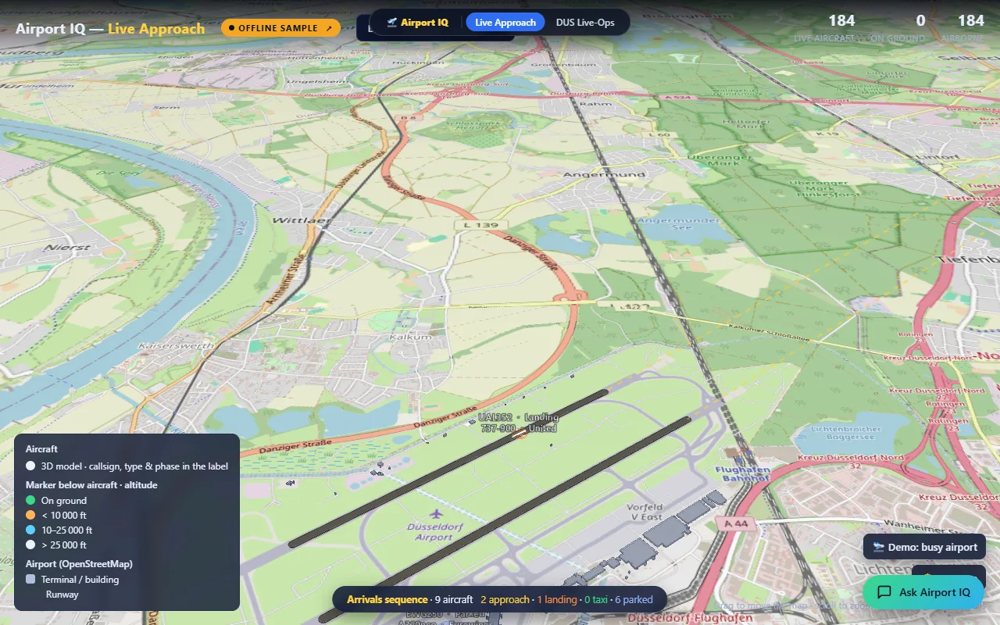 | **[Airport IQ - Live Approach](industry/airport-iq/)** | Live approach and ground operations on a photoreal 3D airport twin. |
| 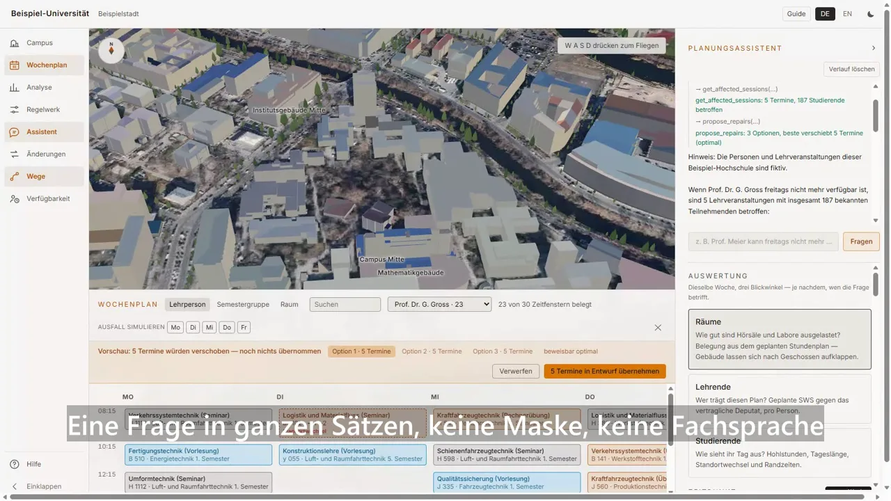 | **[Campus Scheduler](industry/education/campus-twin/)** | A timetable planner's cockpit over a photoreal 3D campus twin, built entirely from open geodata — state 1 m terrain under a 20 cm orthophoto, LoD2 buildings that open into their own floors, and eight German universities in one build — with hard-constraint conflict detection, cascade what-if, and an OR-Tools CP-SAT solver proposing the smallest set of moves that repairs the week. |
|  | **[Flood Insights](industry/flood-insights/)** | Flood risk and gauge levels on a 3D terrain twin, with an IBCS Power BI report. |
| 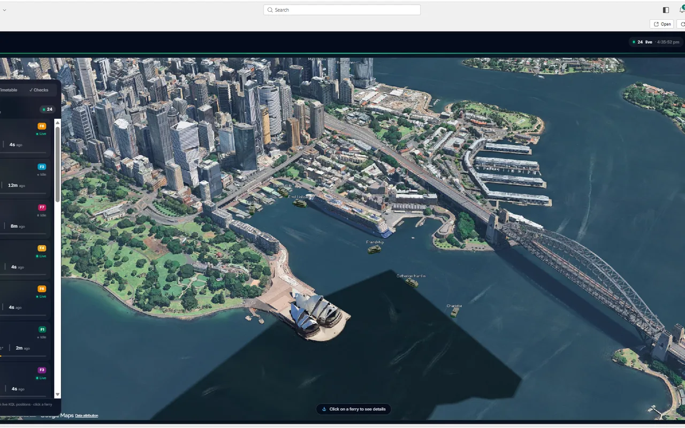 | **[Harbour Pulse](industry/harbour-pulse/)** | Real-time ferry operations in Sydney Harbour on an Eventhouse-backed 3D map. |
| 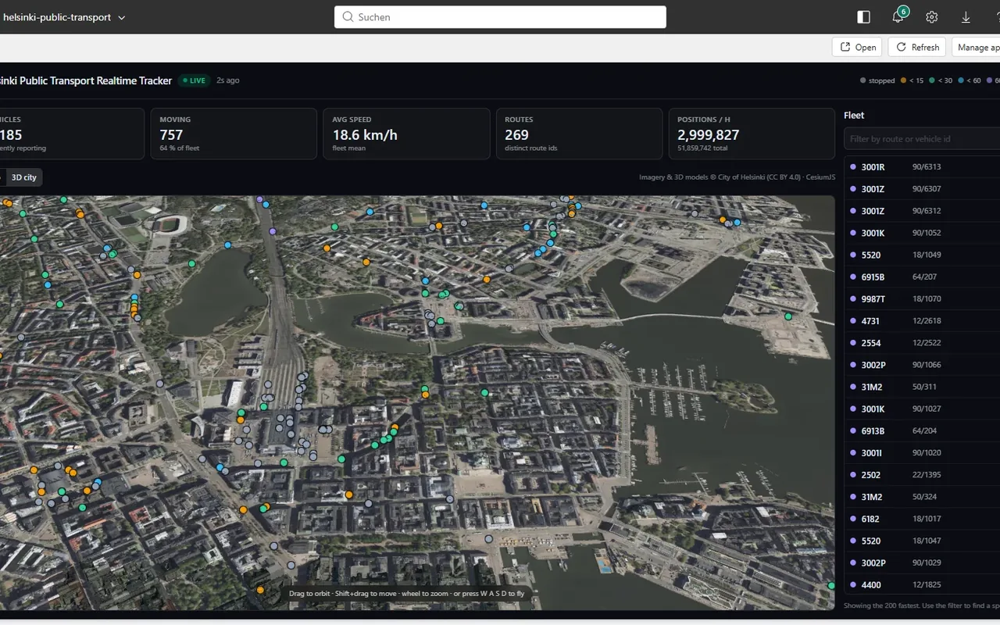 | **[Helsinki Public Transport](industry/helsinki-public-transport/)** | Live tram and bus positions from the HSL feed, streamed through Real-Time Intelligence. |
| 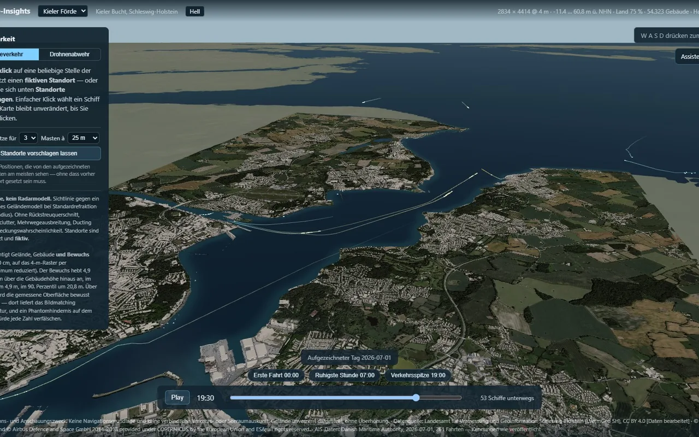 | **[Maritime Insights](industry/maritime-insights/)** | Vessel movements, port calls and cargo flows on a live maritime map. |
| 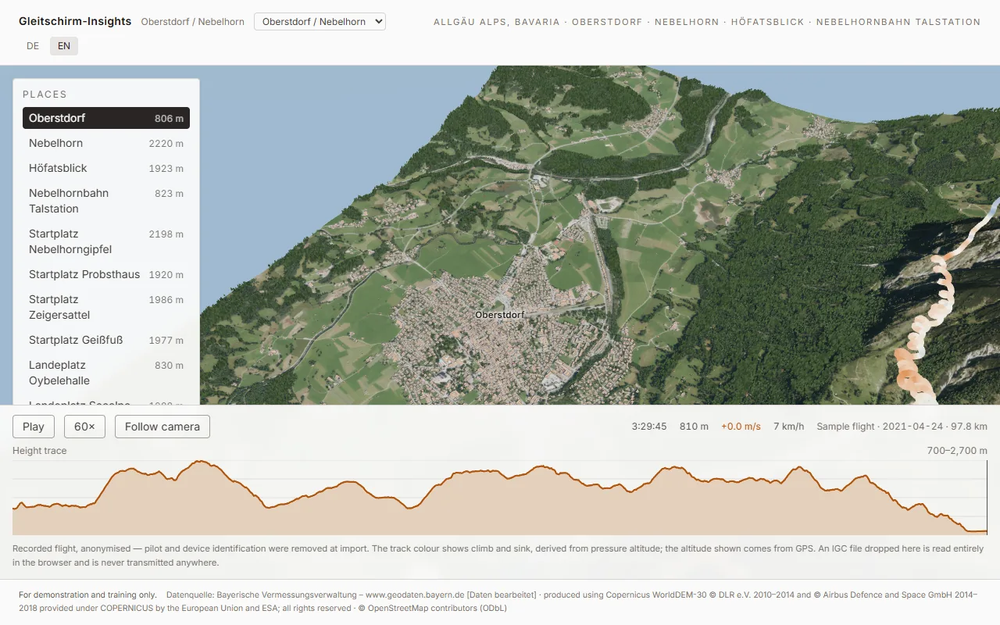 | **[Paragliding Insights](games-and-learn/paragliding-insights/)** | Photoreal 3D flight map of the Allgaeu Alps with real IGC tracks and live traffic. |

### 📊 Analytical Apps

Apps that put data and insight in front of an end user.

| | App | What it does |
|---|---|---|
| 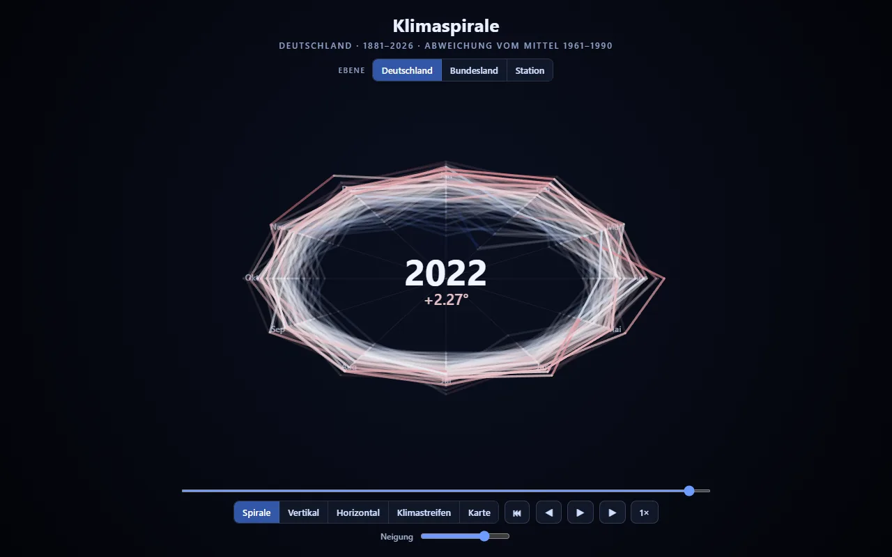 | **[Climate Spiral](industry/dwd-klimaspirale/)** | A century of German weather-service temperature records as an animated climate spiral. |
| 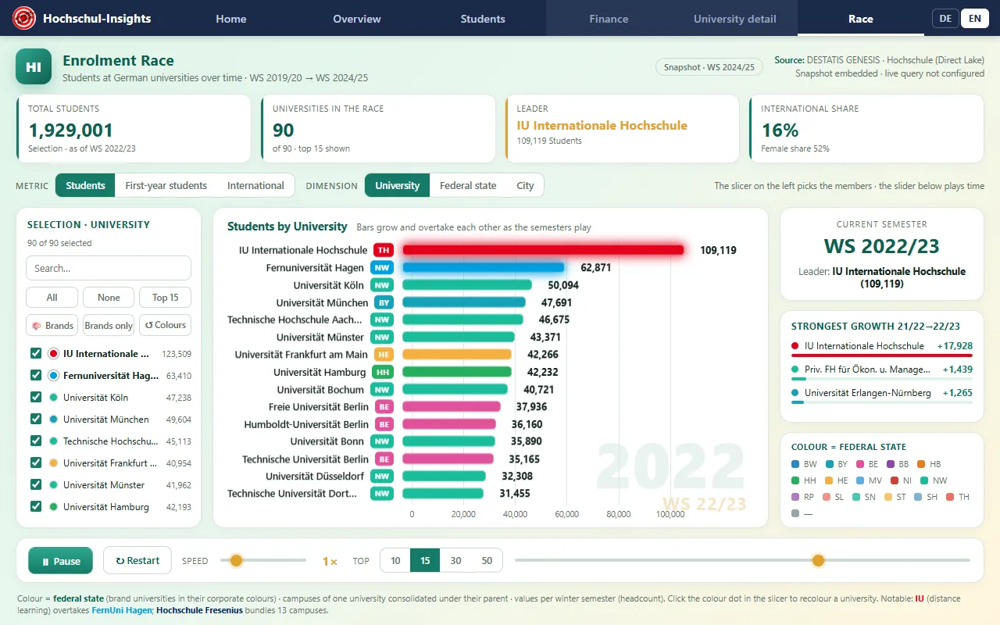 | **[Higher Education Race Chart](industry/education/hochschul-race/)** | Student numbers across German universities as an animated bar-chart race. |

### 🧰 Fabric and Power BI Tools

Apps that inspect, document or administer the data platform itself.

| | App | What it does |
|---|---|---|
|  | **[Data Catalog](fabric-admin/data-catalog/)** | A browsable catalogue of every item in your Fabric tenant, with lineage and ownership. |
| 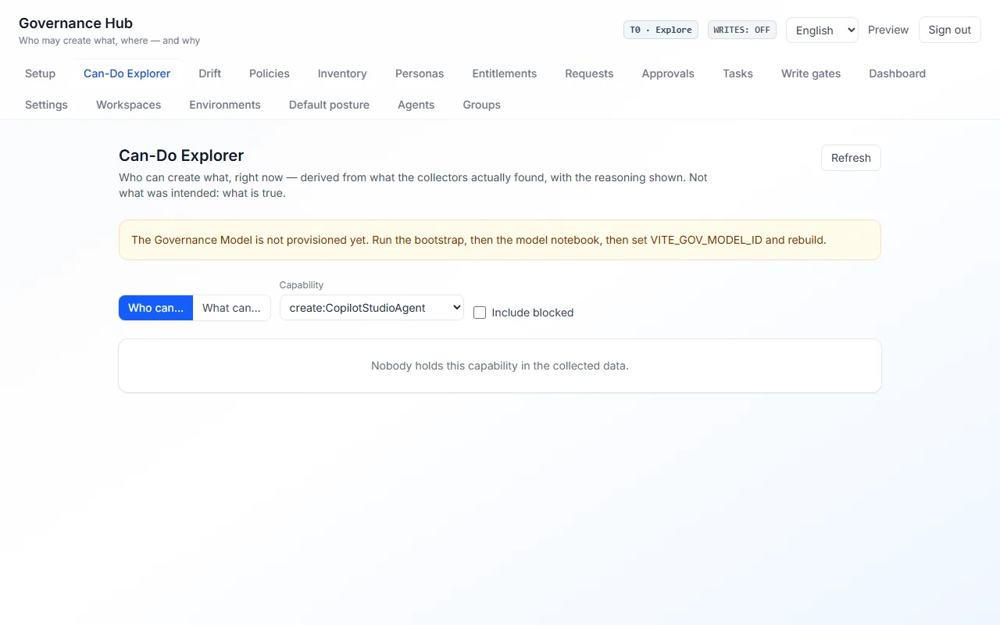 | **[Governance Hub](fabric-admin/governance-hub/)** | Tenant settings, capacity and access posture in one place, collected on a schedule. |
| 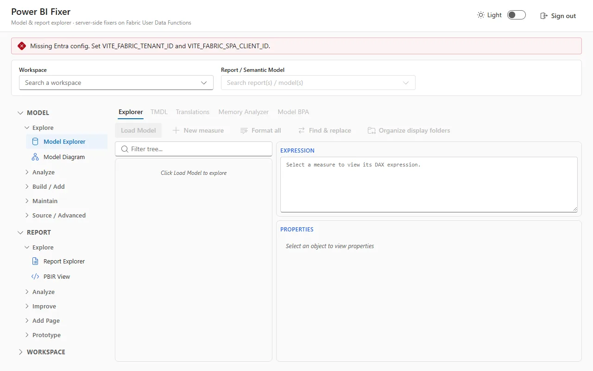 | **[Power BI Fixer](fabric-admin/pbi-fixer/)** | A whole Power BI toolbench in the browser: model and report explorers, BPA with one-click fixes, memory analysis, AI translations, PBIR prototyping and workspace automation. |

### 🎮 Games and Interactive Learning

Canvas and game-engine apps — proof there is no UI ceiling.

| | App | What it does |
|---|---|---|
| 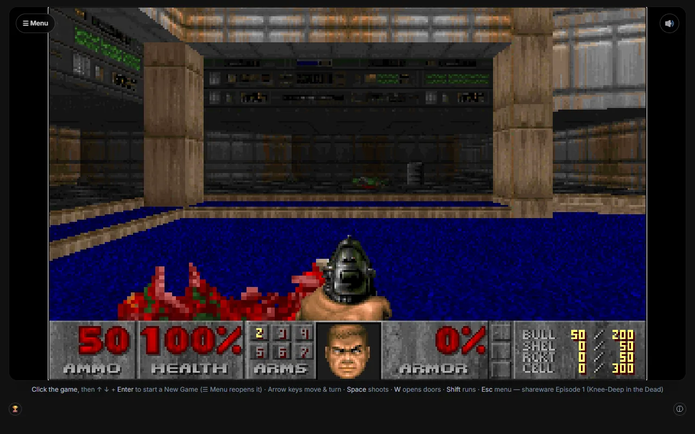 | **[Doom](games-and-learn/doom/)** | Doom running on Fabric - a WASM port with scores and telemetry in a Fabric SQL database. |
| 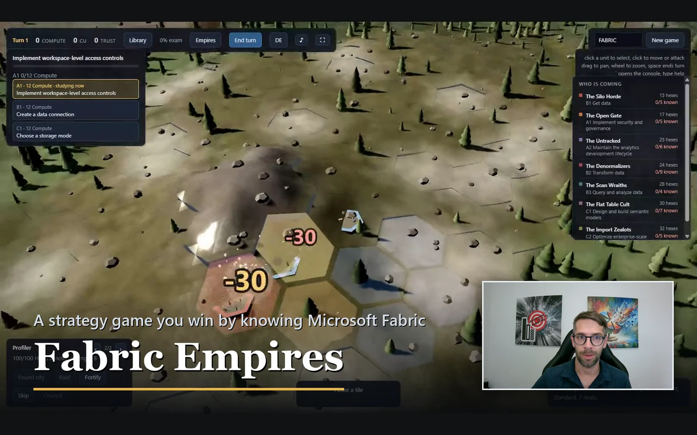 | **[Fabric Empires](games-and-learn/fabric-empires/)** | A turn-based 4X strategy game whose entire game state lives in Fabric. |
|  | **[IBCS Trainer](games-and-learn/ibcs-trainer/)** | Learn the IBCS notation standard by fixing charts, stage by stage. |
| 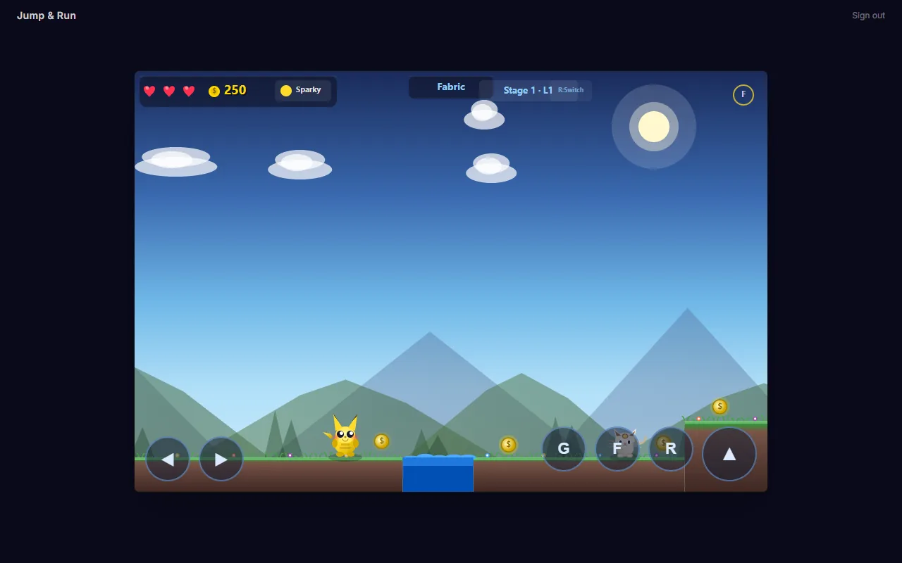 | **[Jump and Run](games-and-learn/jump-and-run/)** | A canvas platformer with levels and high scores served from Fabric. |

*16 apps. This table is generated by `tools/generate_index.py` from each app's `package.json` — edit the app, not the table.*

<!-- APPS:END -->

## Deploying any of them

Every app uses the [Rayfin](https://github.com/microsoft/project-rayfin) CLI. From an app folder:

```bash
npm install
npx rayfin up --workspace-id <your-workspace-guid> --tenant <your-tenant-guid>
```

Depending on the app, `rayfin up` provisions some combination of a static web app, a SQL data model,
Lakehouse storage, Entra sign-in and backend functions. Each app's README says which.

Nothing here contains credentials or tenant coordinates: `rayfin/rayfin.yml` ships with loopback
redirect URIs only, and where an app needs a workspace or item id it reads it from the environment
with no default.

## Contributing

See [CONTRIBUTING.md](CONTRIBUTING.md) for the layout, the publication gate, the media budget and
the app README template.

## Licence

MIT — see [LICENSE](LICENSE).
