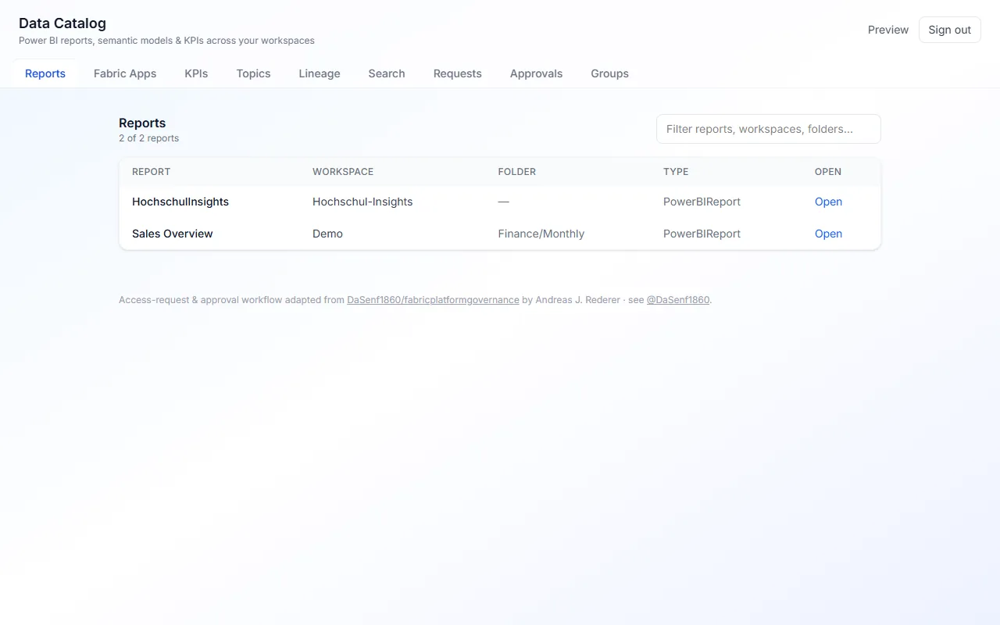

# Data Catalog — Rayfin App

<!-- TODO(phase-1e): no preview yet. Once `docs/previews/data-catalog.webp` exists, replace this comment with:
      -->

A Fabric-wide catalog of Power BI **reports**, **semantic models**, and their **KPIs**
(measures / columns), with reverse lookup (which KPI is used in which report), lineage,
a topic (workspace + folder) tree, global search — and an access-request front door.

Full design & phases: PLAN.md.

## What it does

- Every workspace and item in your tenant, scanned on a schedule into a Lakehouse
- Lineage and ownership per item
- Search across the whole tenant
- Runs entirely inside your own tenant

## Architecture (two-tier)

```
Scanner notebook (sempy + semantic-link-labs, scheduled)
        → Catalog Lakehouse  data_catalog_lh  (Delta cat_* tables)
        → Direct Lake semantic model  "Data Catalog Model"
        → this Rayfin app (reads via fabric_proxy executeQueries UDF)
```

- **scanner/** — the Fabric notebook that crawls every accessible workspace and writes the
  `cat_*` Delta tables. See scanner/README.md.
- **src/** — the React 19 + Vite 7 + Fluent UI v9 SPA (Fabric brokered auth).
- **rayfin/** — Rayfin service config (`rayfin.yml`) + the `AccessRequest` data entity.

## Develop

```powershell
npm install
npm run build:fabric   # tsc -b && vite build — must be green
npm run dev            # local dev against the mock backend
```

## Deploy

Target: **Rayfin Apps** workspace `${FABRIC_WORKSPACE_ID}`,
tenant `fc3a8969-…` (MCAPS), capacity `prdsweden` (resume before deploy).

```powershell
npx rayfin up --workspace-id ${FABRIC_WORKSPACE_ID} --tenant ${FABRIC_TENANT_ID} -y
```

Sign in with the MCAPS-native account `you@example.com`.

## Status

Phases 0–8 built & deployed: scanner + catalog lakehouse + Direct Lake model, the five
views (report list · KPI→reports reverse index · lineage · topic tree · global search),
nightly refresh, and the access-request + approval workflow. Live at the hosting URL from
`rayfin up`.

## Credits & Acknowledgements

The access-request/approval workflow and parts of the Fabric plumbing are adopted from the
open-source work of **Andreas J. Rederer** ([@DaSenf1860](https://github.com/DaSenf1860)) —
notably [`fabricplatformgovernance`](https://github.com/DaSenf1860/fabricplatformgovernance)
and [`ms-fabric-sdk-core`](https://github.com/DaSenf1860/ms-fabric-sdk-core). See
[CREDITS.md](./CREDITS.md) for the full list of adopted elements and attribution.

## Getting started

```bash
npm install
npm run dev
npx rayfin up --workspace-id <your-workspace-guid> --tenant <your-tenant-guid>
```

Any workspace or item id this app needs is read from the environment, with no default.

## Project structure

```
public/         static assets served as-is
rayfin/         deployment config - redirect URIs are loopback only
scanner/        tenant scanner
src/            the application
```

## Scripts

| Script | What it does |
|---|---|
| `npm run build` | production build |
| `npm run build:fabric` | build the bundle Fabric static hosting serves |
| `npm run dev` | dev server on http://localhost:5173 |
| `npm run lint` | lint |
| `npm run rayfin:up` | deploy to your Fabric workspace |
| `npm run test` | unit tests |

## Data

Your own tenant, read through the Fabric scanner API with your own identity. Nothing is bundled and nothing leaves.
