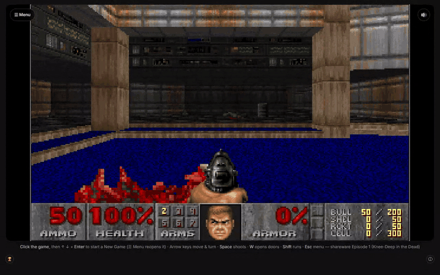

# Doom (Rayfin) — "But can it run Doom?" on Microsoft Fabric




DOOM running as a **Fabric App**: the classic game booted in the browser through
[js-dos](https://js-dos.com/) / DOSBox, wrapped in a Fabric-authenticated
Rayfin app. Sign in with your Fabric identity and the shareware DOOM boots
straight into a playable demo loop.

> **But can it run Doom?** — the traditional proof that a platform has matured.
> With Fabric Apps you can run pro-code in Fabric, so… yes, it can. 🔫

---

## What it does

- Sign in with your Fabric identity and shareware DOOM boots straight into a playable loop
- Runs in the browser through js-dos / DOSBox - nothing to install
- Scores and saves persist to a typed entity in Fabric SQL

## 🙌 Credits — this is entirely Sander van de Velde's work

**I did not invent, design, or build anything original here.** This project is a
straight re-use of Sander van de Velde's idea and implementation. All credit for
"Doom as a Microsoft Fabric App" belongs to him:

- **Sander van de Velde** — original concept and Fabric/Rayfin integration
  - Repo: **[sandervandevelde/Play-Doom-On-Microsoft-Fabric](https://github.com/sandervandevelde/Play-Doom-On-Microsoft-Fabric)**
  - LinkedIn post: **[Playing Doom as a Microsoft Fabric App](https://www.linkedin.com/posts/sandervandevelde_mvpbuzz-share-7476168860279341056-2Xrv/)**
  - Blog: **[Playing games as a Microsoft Fabric App via Rayfin](https://sandervandevelde.wordpress.com/2026/06/07/playing-zork-i-as-a-microsoft-fabric-app-via-rayfin/)**
- **[thedoggybrad/doom_on_js-dos](https://github.com/thedoggybrad/doom_on_js-dos)** — DOOM-in-the-browser via js-dos / DOSBox
- **id Software** — DOOM (engine + shareware game data)
- **[Freedoom](https://freedoom.github.io/)** — the BSD-licensed free game data set (see the licensing note below)

My only contribution was operational: cloning Sander's repo, swapping the game
data for **freely-redistributable assets**, self-hosting the runtime, and
deploying it into a Fabric workspace. If you like this, **go star and follow
Sander's work** — it is his.

---

## What changed vs. Sander's original

Sander's app boots DOOM by hot-linking the js-dos runtime **and a commercial
WAD** (`DOOM-@evilution.zip`, i.e. Final Doom) from an external site. That is
perfect for a personal demo, but a public template should not depend on — or
redistribute — purchased game data. So this fork:

| | Sander's original | This fork |
|---|---|---|
| js-dos / DOSBox runtime | hot-linked from `thedoggybrad.github.io` | **self-hosted** in `public/jsdos/` (GPL) |
| DOS engine | `DOOM.EXE` from external zip | id Software **shareware** `DOOM.EXE` (free to redistribute) |
| Game data (IWAD) | commercial `DOOM.WAD` (Final Doom) | id Software **shareware** `DOOM1.WAD` (free to redistribute) |
| External network calls at runtime | yes | **none** — fully self-contained |

> **Why not Freedoom?** Freedoom (BSD) was the preferred fully-libre data set,
> but its v0.13 IWAD is ~28 MB — it exceeds em-dosbox's in-browser memory *and*
> it targets limit-removing source ports, whereas the js-dos engine is
> **vanilla** DOSBox DOOM. It crashes on load. The id **shareware** episode is
> vanilla-compatible, small, and — importantly — id Software has always licensed
> the shareware release for **free redistribution**, so it is safe to ship.
> Swapping in Freedoom later only requires a limit-removing DOS port (e.g. a
> Boom build) bundled next to the WAD.

## Getting started

```bash
npm install
npm run dev
```

Open <http://localhost:5173>, sign in (mock email/password locally), and DOOM
boots in the page. Click the canvas to start.

> Self-contained — it depends only on the published `@microsoft/rayfin-*`
> packages from the public npm registry.

## Deploy to Fabric

```bash
npm run rayfin:up            # deploy into "My Workspace"
# or target a specific workspace:
npx rayfin up --tenant <tenantId> --workspace-id <workspaceId> -y
```

`rayfin up` builds (`npm run build:fabric`), packages `dist/` (the app +
self-hosted `jsdos/` runtime + `game/doom.zip`), and publishes it as an
`AppBackend` item with a Fabric-hosted URL and brokered auth.

## Project structure

```text
├── public/
│   ├── jsdos/
│   │   ├── js-dos-api.js    # js-dos v6 loader (patched to same-origin runtime)
│   │   └── js-dos-v3.js     # DOSBox WASM/asm.js runtime (GPL, self-hosted)
│   └── game/
│       └── doom.zip         # DOS bundle: shareware DOOM.EXE + DOOM1.WAD (+ setup files)
├── rayfin/
│   └── rayfin.yml           # Fabric service config (auth + static hosting)
├── src/
│   ├── main.tsx             # Entry point + Rayfin client bootstrap
│   ├── App.tsx              # Routes and auth gate
│   ├── pages/HomePage.tsx   # Boots DOOM via js-dos into the page
│   ├── hooks/AuthContext.tsx
│   ├── components/AuthPage.tsx
│   └── services/            # Auth + typed Rayfin client wiring
└── package.json
```

## Scripts

| Command | Description |
|---------|-------------|
| `npm run dev` | Deploy app to Fabric and start local dev server |
| `npm run build` | Production build |
| `npm run build:fabric` | Build for Fabric deployment |
| `npm run lint` | Lint with ESLint |
| `npm run test` | Run unit tests with Vitest |
| `npm run rayfin:up` | Deploy app to Fabric (no local dev server) |

## Install as an awesome-rayfin template

```bash
npm create @microsoft/rayfin@latest -- --template https://github.com/microsoft/awesome-rayfin --template-name "Doom"
```

---

## ⚖️ Licensing & "can I do this?" (plagiarism / IP assessment)

Short answer: **yes, this is safe to publish** — provided the attribution above
stays intact and the shipped WAD stays the **shareware** one (or is swapped for
Freedoom). Details:

### 1. Authorship / plagiarism
This is **not** passed off as original work. The idea and the Fabric integration
are explicitly credited to **Sander van de Velde** (repo, LinkedIn post, blog),
DOOM-in-the-browser to **thedoggybrad**, and DOOM itself to **id Software**. With
those credits present, there is no plagiarism concern — it is a clearly-attributed
derivative/redeployment.

### 2. The DOOM engine (source code)
id Software released the DOOM engine **source code under the GPL** (1997/1999).
js-dos / DOSBox are **GPL/LGPL**. Self-hosting the GPL runtime is fine.

### 3. The game data (WAD) — the part that actually matters
- The **retail/commercial** WADs (`DOOM.WAD`, Ultimate Doom, Final Doom, Doom II)
  are **copyrighted** by id Software / ZeniMax (now part of Microsoft). **Do not
  redistribute these.** Sander's original only *hot-links* one, but this template
  **removed** that dependency.
- The **shareware** episode (`DOOM1.WAD` + shareware `DOOM.EXE`) is **licensed by
  id for free redistribution** (that was the whole point of shareware). Shipping
  it in this repo is allowed. ✅
- **Freedoom** is **BSD-licensed** and 100% free to ship, but is technically
  incompatible with the vanilla js-dos engine here (see the note above). It
  remains the cleanest option if you add a limit-removing DOS port.

### 4. Trademark
"DOOM" is a **registered trademark** of id Software / ZeniMax / Microsoft. This
template uses the name only descriptively (to say what it runs) and does **not**
imply endorsement by, or affiliation with, id Software or Microsoft. Avoid using
official DOOM logos/marks in a way that suggests sponsorship.

### 5. Bottom line
- ✅ Ship it publicly **with** the credits above and the **shareware** WAD.
- ✅ Or ship it with **Freedoom** (BSD) for a fully-libre data set.
- ❌ Do **not** commit or redistribute any commercial/retail DOOM WAD.

> Attribution note for a PR: *"This template is a redeployment of Sander van de
> Velde's Play-Doom-On-Microsoft-Fabric. All original design and Fabric
> integration are his. GitHub Copilot assisted with re-pointing the assets to
> freely-redistributable shareware data, self-hosting the runtime, and the
> Fabric deployment; testing and verification were done in a real browser and on
> the deployed Fabric app."*

## Fabric architecture

`npx rayfin up` provisions:

- Entra sign-in (Fabric identity)
- Fabric SQL database
- Static web app

## Data

<!-- TODO: name the source, its licence, and say plainly whether any of it is generated. If it is generated, the app must badge it as such. -->
