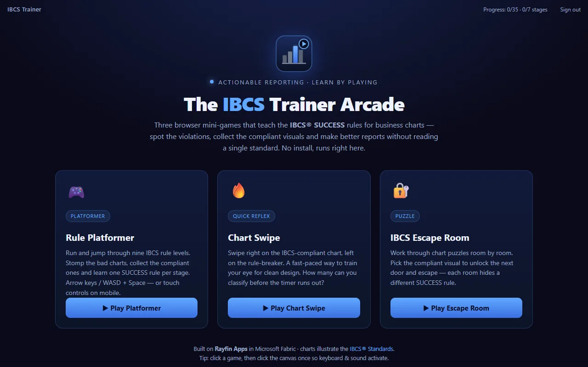

# IBCS Trainer (Rayfin)

<!-- TODO(phase-1e): no preview yet. Once `docs/previews/ibcs-trainer.webp` exists, replace this comment with:
      -->

A single-file HTML5 Canvas platformer
([`ibcs_trainer.html`](public/game/ibcs_trainer.html)) that teaches IBCS chart
rules level by level, embedded in a Fabric-authenticated Rayfin app. You play a
data analyst who conquers bad chart types: pie charts explode, the wrong chart
for a time series must be destroyed, and colorful clutter gives way to clean
black-and-grey notation. It runs in an `<iframe>` and reports each finished
play-through to the host, which persists it to a typed `GameStats` entity
through the Rayfin data client.

> **IBCS Trainer 2.0** — this repo expands the trainer toward full
> [IBCS® SUCCESS](https://www.ibcs.com) coverage: **all ~98 rules become
> levels**, organised into 7 stages (one per SUCCESS pillar) and 35 substages
> (one per rule group), with **substage checkpoints** (clear a substage to start
> from it). A final-boss capstone is followed by an **ISO 24896 memory room**.

### Three games, one rule registry

The host now offers a launcher with three IBCS mini-games, all driven by a single
shared rule registry ([`public/game/ibcs_rules.js`](public/game/ibcs_rules.js),
the in-code mirror of the master Do/Don't table):

| Game | File | Loop |
|---|---|---|
| **Rule Platformer** | [`ibcs_trainer.html`](public/game/ibcs_trainer.html) | Jump & run through all 98 rules, 7 stages, checkpoints and the ISO 24896 vault. |
| **Chart Swipe** | [`ibcs_swipe.html`](public/game/ibcs_swipe.html) | Swipe right on compliant charts, left on the violations — combos, lives, rule card on a miss. |
| **IBCS Escape Room** | [`ibcs_escape.html`](public/game/ibcs_escape.html) | Solve a rule puzzle on each door to reveal a code digit, present the board message, then crack the vault keypad. |

Shared front-end helpers: [`ibcs_charts.js`](public/game/ibcs_charts.js) renders
the IBCS chart glyphs and [`ibcs_stats.js`](public/game/ibcs_stats.js) posts a
schema-complete `rayfin-game-stats` payload to the host.

## What it does

- One IBCS notation rule per level, taught by playing it rather than reading it
- Pie charts explode; the wrong chart for a time series has to be destroyed
- Progress and scores persist to Fabric SQL, so a team can run it as a shared exercise

## Design docs

The complete rule set and the game design live in [`docs/`](docs/):

| Doc | Contents |
|---|---|
| [`docs/IBCS-Rules-and-Trainer-Plan.md`](docs/IBCS-Rules-and-Trainer-Plan.md) | The full IBCS SUCCESS rule catalogue (master Do/Don't table) + the 7-stage / 35-substage / ~98-level trainer plan, final boss, and ISO 24896 memory room. |
| [`docs/IBCS-Game-Ideas.md`](docs/IBCS-Game-Ideas.md) | 12 alternative game concepts that train the same rule set. |
| [`docs/IBCS-Rule-Image-Mapping.md`](docs/IBCS-Rule-Image-Mapping.md) | Maps all 98 rules to their Do/Don't chart image files (`public/game/img/`), the single source of truth for the per-rule picture bank. |
| [`docs/poster/`](docs/poster/) | Source IBCS SUCCESS poster images. |

## Getting started

```bash
npm install
npm run dev
```

Open http://localhost:5173, sign in, and play. When a run ends (win or game
over), the game posts its stats to the React host and the header shows
"Run saved".

### Mobile landscape & desktop

Each game renders to a fixed 900×600 canvas. On desktop and inside the Fabric
`<iframe>` that native size is used; on phones and tablets the shared helper
[`ibcs_mobile.js`](public/game/ibcs_mobile.js) scales the canvas to fill the
viewport (preserving its 3:2 ratio), shows a "rotate to landscape" hint in
portrait, and — for the Rule Platformer — draws an on-screen gamepad whose
buttons dispatch the same key events the game already handles, so touch and
keyboard share one code path. The host iframe is sized responsively so the
games fit mobile-landscape screens while still running full-size as a Rayfin
app.

> This app is fully self-contained — it depends only on the published
> `@microsoft/rayfin-*` packages (v1.33.x) from the public npm registry, so it
> installs and runs on its own without the `project-rayfin` monorepo.

## How the migration works

| Original (Fabric notebook) | This app |
|---|---|
| Game played via `displayHTML()` in a notebook cell | Game served from `public/game/` and rendered in an `<iframe>` |
| Game-over JSON hand-pasted into a Save cell | `stats.publish()` posts the JSON via `window.parent.postMessage` |
| JSON appended to a `game_stats` Delta table | `GamePage` calls `client.data.GameStats.create(...)` |

The only change to the game file is in `stats.publish()`, which now also
`postMessage`s the payload to the parent window.

## Stage progress & authentication

Players sign in with **Entra ID** through the Fabric brokered auth flow
([`RayfinAuthService`](src/services/RayfinAuthService.ts)), so every record is
tied to a real identity. As the platformer clears each substage it posts a
`rayfin-stage-complete` message; the host upserts it to a per-user
[`StageProgress`](rayfin/data/StageProgress.ts) row, so the player's profile
tracks **which of the 35 substages / 7 SUCCESS stages are already completed**
(shown live in the header). On sign-in the host loads that progress back and
pushes it into the game, so substage checkpoints unlock on any device the
player signs in from.

## Project structure

```text
├── public/game/
│   ├── ibcs_trainer.html             # Rule Platformer (touch + keyboard)
│   ├── ibcs_swipe.html               # Chart Swipe
│   ├── ibcs_escape.html              # IBCS Escape Room
│   └── ibcs_mobile.js                # Responsive scaling + touch gamepad
├── rayfin/
│   ├── rayfin.yml                    # Fabric service config (auth + data + hosting)
│   └── data/
│       ├── GameStats.ts              # One row per play-through
│       ├── StageProgress.ts          # One row per completed substage (per user)
│       └── schema.ts                 # Registers GameStats + StageProgress
├── src/
│   ├── main.tsx                      # Entry point + Rayfin client bootstrap
│   ├── App.tsx                       # Routes and auth gate
│   ├── pages/GamePage.tsx            # Embeds the games + saves stats & progress
│   ├── hooks/AuthContext.tsx         # Auth context
│   ├── components/AuthPage.tsx       # Sign-in UI
│   └── services/                     # Auth + typed Rayfin client wiring
└── package.json
```

## The data model

`GameStats` (`rayfin/data/GameStats.ts`) mirrors the game's `stats.toJSON()`
payload (score, deaths by cause, coins, jumps, attacks, forms collected, final
form, level reached, duration). `StageProgress`
(`rayfin/data/StageProgress.ts`) records one row per IBCS substage a player has
completed (substage/stage index, pillar, whether the whole stage was cleared).
Both are scoped to the signed-in player via `user_id` (from the JWT `sub`
claim), so a player only sees their own runs and progress.

## Scripts

| Command | Description |
|---------|-------------|
| `npm run dev` | Deploy app to Fabric and start local dev server |
| `npm run build` | Production build |
| `npm run build:fabric` | Build for Fabric deployment |
| `npm run lint` | Lint with ESLint |
| `npm run test` | Run unit tests with Vitest |
| `npm run rayfin:up` | Deploy app to Fabric (no local dev server) |

## Fabric architecture

`npx rayfin up` provisions:

- Entra sign-in (Fabric identity)
- Fabric SQL database
- Static web app

## Credits

Part of [Fabric-Apps](../../README.md), MIT licensed.

## Data

The IBCS notation standard. No external data.
