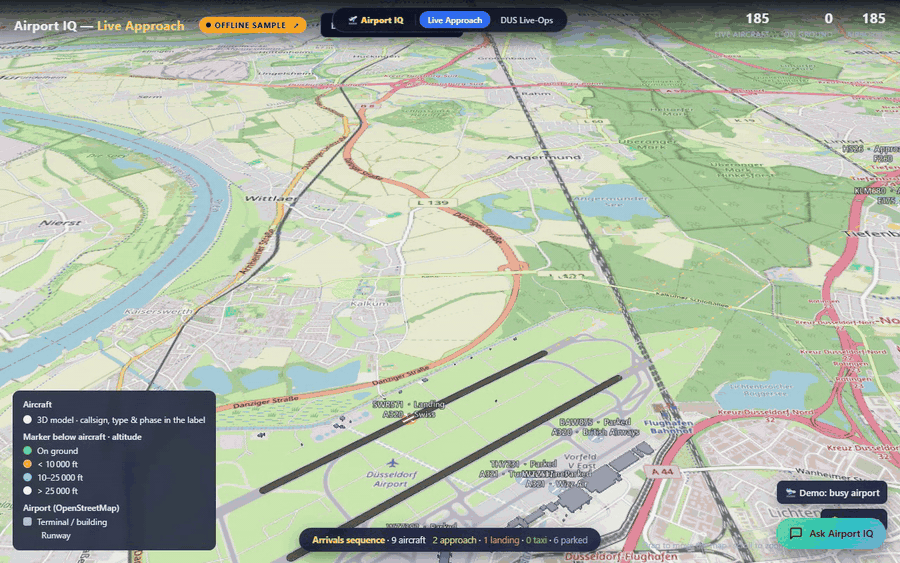

# Airport IQ — Rayfin app (`live-approach`)




The single, deployed **Airport IQ** Rayfin static-hosting app. A dark landing page
([`index.html`](index.html)) with two tiles that open the two 3D views. This app supersedes the
older four-view `apps/archive/airport-iq` hub.

- **Fabric item:** `Airport IQ` — AppBackend `<app-item-id>`
  (workspace `<your-workspace-id>`, capacity `prdsweden`, Sweden Central)
- **Live URL:** <<your-app-host>.webapp.fabricapps.net>
- **Archive copy:** `Airport IQ - Archive` (`<archive-item-id>`,
  <<your-app-host>.webapp.fabricapps.net>) — a superseded snapshot, kept for reference.

## What it does

- Live aircraft on approach from the public airplanes.live ADS-B API
- A 3D airport model built from real OpenStreetMap gate geometry
- Two views - the approach, and what is happening on the ground - behind one landing page

## The two portions (views) and their data sources

The app bundles **two independent 3D views**. They use **different engines** and, importantly,
**different data sources** — one is driven by a **live external feed**, the other by a
**pre-generated synthetic snapshot**. All geometry (buildings, runways, gates) in both views comes
from **OpenStreetMap**, filtered to the aerodrome boundary.

| | **① Live Approach** | **② Live-Ops** |
| --- | --- | --- |
| File | [`views/approach/index.html`](views/approach/index.html) | [`views/liveops/index.html`](views/liveops/index.html) |
| Engine | **CesiumJS 1.121** (real 3D globe) | **Three.js r160** + OrbitControls (local apron scene) |
| What it shows | Real aircraft on approach → landing → taxi → park, zoomable from orbit to the apron | Gate operations — time-scrubber, docking at real gates, delays, cascading gate conflicts |
| Airports | FRA · MUC · BER · DUS · AMS (dropdown) | DUS · BER only (`?ap=DUS` / `?ap=BER`) |
| **Aircraft data** | **LIVE** | **Synthetic snapshot** |

### ① Live Approach — data sources

Real-time, external, per-airport. Nothing here is stored aircraft data — it is polled live.

- **Live aircraft (real-time):** the public **airplanes.live** ADS-B REST API —
  `GET https://api.airplanes.live/v2/point/{lat}/{lon}/180`, polled every **15 s**.
  Positions, altitude, ground-speed, track, hex and type come straight off the live feed and are
  driven through the approach/land/taxi/park choreography.
  - **Offline fallback:** if the API is unreachable, [`views/approach/data/live.json`](views/approach/data/live.json)
    (a captured sample) is used so the view is never empty.
- **Base map:** **OpenStreetMap** raster tiles (`https://tile.openstreetmap.org/{z}/{x}/{y}.png`) —
  no Cesium Ion token, no terrain.
- **Airport geometry:** `views/approach/data/<IATA>.geojson` — extruded **OSM** building footprints,
  runways and gates, filtered to the airport's OSM aerodrome boundary. One file per airport:
  `FRA` `MUC` `BER` `DUS` `AMS`. **DUS** additionally carries **OSM taxiway centrelines**
  (`kind:"taxiway"` line features) that the arrival taxi router follows (see below).
- **Airport manifest:** [`views/approach/data/airports.json`](views/approach/data/airports.json) —
  the focus list + each airport's centre lat/lon and elevation (used to centre the globe / camera).

### ② Live-Ops — data sources

Fully **synthetic and pre-generated** — no live feed. The operational schedule is the *Airport IQ
operational model* repositioned onto the airport's **real OSM geometry**.

- **Operations snapshot:** `views/liveops/data/<AP>/snapshot.json` — the synthetic schedule:
  `gates`, `airlines`, `airports`, `flights`, `assignments`, `delays`, `conflicts`, plus a `meta`
  time window. Its own `meta.source` records the provenance, e.g.
  *"Airport IQ operational model repositioned onto Düsseldorf OSM geometry (real gates)"*.
- **Buildings:** `views/liveops/data/<AP>/buildings.json` — **OSM** footprints, aerodrome-filtered.
- **Runways:** `views/liveops/data/<AP>/runways.json` — runway centrelines (two parallel runways per
  airport: DUS `05R/23L`+`05L/23R`, BER `06L/24R`+`06R/24L`).
- Available only for `DUS` and `BER` (the two airports for which the operational snapshot exists).

## Data-source summary

| Data | Source | Type | Used by |
| --- | --- | --- | --- |
| Live aircraft positions | **airplanes.live** ADS-B API (poll 15 s) | Live external feed | Live Approach |
| Aircraft fallback | `approach/data/live.json` | Captured sample | Live Approach |
| Base map tiles | **OpenStreetMap** | Live external tiles | Live Approach |
| Buildings / runways / gates | **OpenStreetMap** (aerodrome-filtered geojson/json) | Static (from OSM) | both views |
| Gate-operations schedule | **Airport IQ synthetic operational model** | Static snapshot (generated) | Live-Ops |

## Live Approach — behaviour & features

[`views/approach/index.html`](views/approach/index.html) — a CesiumJS globe over OSM tiles, centred on
one airport (dropdown / `?ap=`), showing **two layers** of aircraft:

- **Live ADS-B layer** — every real aircraft within 180 nm of the airport, polled from airplanes.live
  every 15 s and dead-reckoned between polls. Coloured by altitude (on-ground / <10k / 10–25k / >25k ft),
  billboard sized by aircraft family.
- **Arrivals choreography** — a rolling sequence of arrivals that fly the full **approach → land →
  taxi → park** cycle, up to 12 at once.

**Verifying the data is real** (so you can check nothing is faked):

- The header **"Live ADS-B ↗"** badge is a link to the airplanes.live live map for the same airport
  (`globe.airplanes.live/?lat&lon&zoom`). The badge also **shows the current data source at a glance**:
  🟢 green *Live ADS-B* = live feed, 🟠 amber *Offline sample* = the API was unreachable so the captured
  `data/live.json` sample is shown, 🔴 red *No live data* = neither source responded.
- Clicking any live aircraft opens an info box with a **"Verify → airplanes.live ↗"** link straight to
  that exact aircraft by its ICAO hex.

**On-map labels (no click needed):** each aircraft shows callsign + **aircraft type** (ICAO code
prettified, e.g. `A388→A380`, `B77W→777-300ER`) + **carrier** (ICAO airline code → name, ~60 carriers;
registration-style callsigns show no carrier rather than a wrong guess).

**Movement realism:** phase durations are **distance-based at realistic ground speeds** (approach ≈175 kt,
taxi ≈47 km/h), so speed stays correct regardless of route length. Arrivals use **two-runway ops**
(longest runway + a parallel sister) and realistic per-airline fleets for the synthetic callsign/type pairs.

**Taxi routing** (`TAXI` module): after landing, each arrival taxis to its stand along a **building-avoiding,
taxiway-following** route — a visibility graph over building-corner nodes plus the **OSM taxiway network**
(taxiway edges are discounted so Dijkstra prefers real centrelines). Validated on DUS: 0 building crossings,
~65 % of each path on real taxiways. Airports without taxiway data fall back to pure building-avoidance.
Stands are pushed clear of every terminal footprint (`parkFix`) so no aircraft parks inside a building.

**Camera:** a floating **🖐 Pan map / ⟳ Orbit airport** toggle switches between free globe panning and
orbiting the focus airport; scroll to zoom from orbit down to the apron.

## Live-Ops — behaviour & features

[`views/liveops/index.html`](views/liveops/index.html) — a Three.js apron scene for DUS/BER driven by the
synthetic operations snapshot. Time-scrubber to see gate occupancy over the schedule window; gate pads
coloured free / occupied / delayed / **conflict**; aircraft rendered as **3D meshes** (fuselage sized by
family, airline-coloured tail fin) that read correctly from any camera angle. Parked aircraft are placed
**nose-in on the apron**, pushed clear of the terminal footprints (no fuselage buried in a pier). Optional
auto-rotate; click a gate for flight/airline/route detail.

## Build & deploy

```powershell
cd apps/live-approach
npm run build:fabric        # assembles fabric-dist/ (tools/build-fabric.mjs)
npm run rayfin:up           # deploy to Fabric static hosting
```

In this workspace deploy via the shared Rayfin binary (the app's own `npm install` token is expired):

```powershell
cd apps/live-approach
..\airport-3d\node_modules\.bin\rayfin.cmd up `
  --workspace-id <your-workspace-id> `
  --tenant ${FABRIC_TENANT_ID} -y
```

> Rayfin does not set the Fabric item `displayName` from `rayfin.yml`; PATCH `/items/{id}` `{displayName}`
> separately if the tile name needs to change.

## Fabric architecture

`npx rayfin up` provisions:

- Entra sign-in (Fabric identity)
- Static web app

## Getting started

```bash
npm install
npm run serve
npx rayfin up --workspace-id <your-workspace-guid> --tenant <your-tenant-guid>
```

Any workspace or item id this app needs is read from the environment, with no default.

## Project structure

```
media/          demo video, GIF and stills
rayfin/         deployment config - redirect URIs are loopback only
server/         backend service / relay
tools/          data pipeline and build helpers
views/
```

## Scripts

| Script | What it does |
|---|---|
| `npm run build:fabric` | build the bundle Fabric static hosting serves |
| `npm run rayfin:up` | deploy to your Fabric workspace |
| `npm run serve` | serve locally |

## Credits

Part of [Fabric-Apps](../../README.md), MIT licensed.

## Data

airplanes.live ADS-B and OpenStreetMap, both public feeds. No tenant data.
