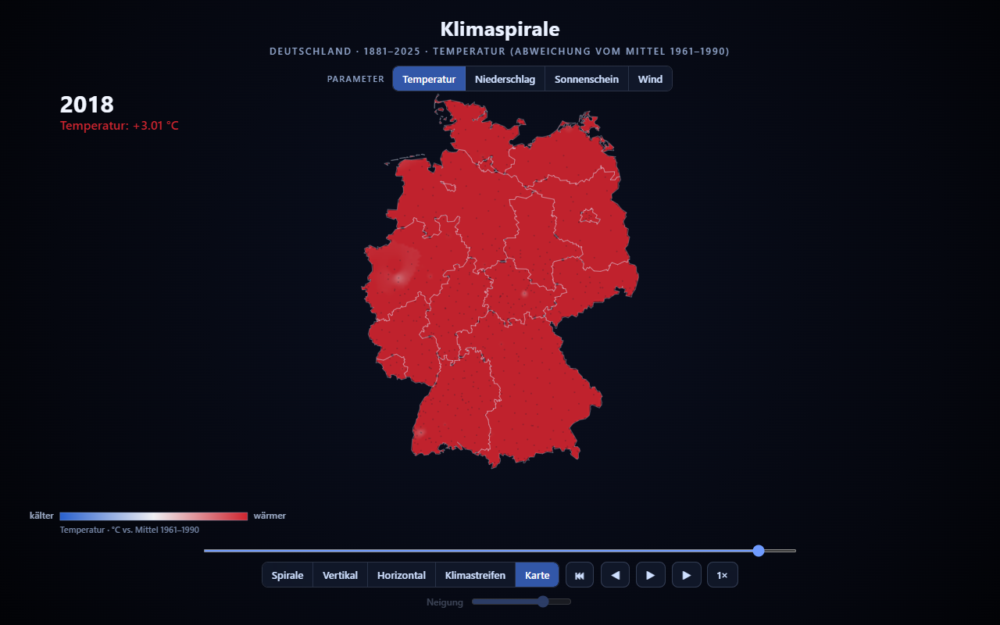
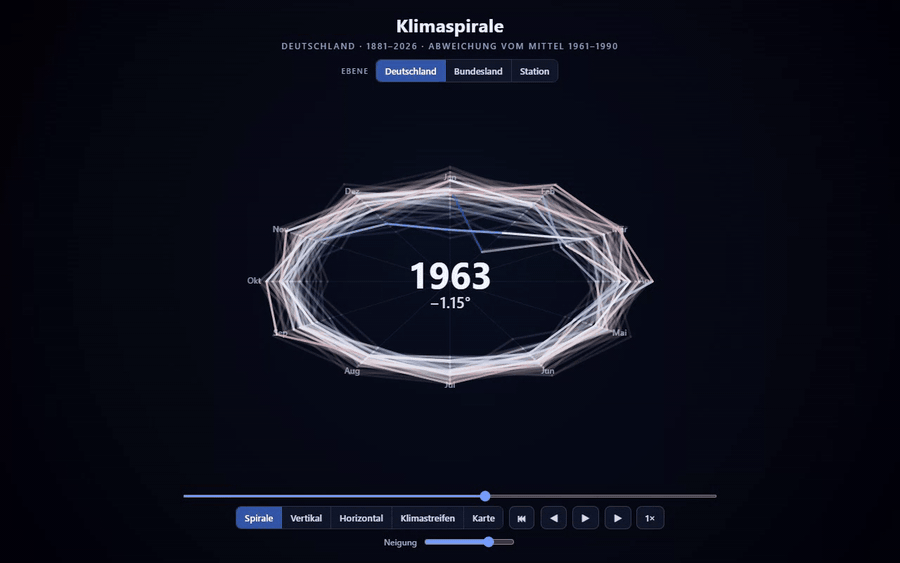

# Klimaspirale — pure HTML / TypeScript

An interactive climate viewer for German weather data, rendered entirely in the
browser with **Canvas 2D + TypeScript** — no Power BI custom visual and no WebGL
dependency, so it drops straight into a **Fabric App** (or any web page /
iframe). Five views share one playback timeline:

- **Spirale** — a tilted climate spiral (yearly mean-temperature anomaly, blue →
  red), whose radius scales **continuously by temperature**;
- **Vertikal** — the years stacked into a NASA-style funnel / tornado;
- **Horizontal** — anomaly time-series bars from the 0° baseline;
- **Klimastreifen** — Ed Hawkins' warming stripes;
- **Karte** — an interpolated (IDW) weather-anomaly **heat map of Germany** with
  a year slider, clipped to the Bundesländer outline, switchable across
  **Temperatur / Niederschlag / Sonnenschein / Wind** (anomaly vs 1961–1990).

The first four views also offer a region picker (Deutschland / Bundesland /
single station); the Karte view interpolates all stations at once. All anomalies
and scaling are computed in the browser from the committed `data/*.json`.





## What it does

- A tilted climate spiral of yearly temperature anomaly
- The same series as a stacked funnel, as anomaly bars, and as warming stripes
- An interpolated heat map of Germany clipped to the federal-state outline
- Five views sharing one playback timeline, in Canvas 2D - no WebGL, no custom visual

## Run it

No build is required to *view* it — the compiled JS in `dist/` and the sample
data in `data/` are committed. Serve the folder over HTTP and open it:

```bash
cd webapp/klimaspirale
npm run serve            # python3 -m http.server 8080
# then open http://localhost:8080/
```

Opening `index.html` directly from disk also works: the app falls back to a
built-in generated sample dataset when it cannot `fetch` the JSON.

## Build (TypeScript)

```bash
cd webapp/klimaspirale
npm install              # installs the TypeScript dev dependency
npm run build            # tsc -> dist/
npm run data             # regenerate data/klimaspirale.json from the sample generator
```

Sources live in `src/`:

| File | Responsibility |
|------|----------------|
| `src/types.ts`  | Data + geometry types (dataset, stations, weather map, Germany outline) |
| `src/data.ts`   | Dataset loaders (`loadMultiDataset`, `loadStations`, `loadWeatherMap`, `loadGermany`), 30-day rolling average, sample generator |
| `src/engine.ts` | All interactive rendering: the five views, region/parameter pickers, controls, IDW map interpolation |
| `src/main.ts`   | Bootstrap — reads `#app` data-attributes and starts the viewer |

(`src/spiral.ts` is the original SVG spiral implementation, kept for reference.)

## Configuration

The `#app` element accepts `data-*` attributes:

| Attribute | Default | Effect |
|-----------|---------|--------|
| `data-src` | `./data/klimaspirale.json` | National + Bundesländer monthly dataset |
| `data-stations` | `./data/stations.json` | Per-station monthly series (region picker) |
| `data-weather` | `./data/weather_map.json` | Per-station annual multi-parameter data (Karte) |
| `data-germany` | `./data/germany.json` | Simplified federal-state outline (map clip + borders) |

## Real data

`data/klimaspirale.json` ships with a deterministic **sample** dataset. To use
real DWD observations, export the daily mean temperature
(`temperature_air_mean_2m`) — averaged across stations per day — into this
shape:

```json
{
  "region": "Deutschland",
  "parameter": "temperature_air_mean_2m",
  "years": [
    { "year": 2014, "days": [ { "date": "2014-01-01", "tMean": 4.2 }, ... ] }
  ]
}
```

There are two ready-made exporters, both producing exactly this shape:

- **In Fabric (recommended).** Run the *“Export Klimaspirale dataset”* cell at
  the end of `DWD-Wetter-Insights Finalize.ipynb`.
  It aggregates `Wetter.BeobachtungenTag` with Spark, writes
  `klimaspirale.json` to the Lakehouse Files area, and supports scoping to a
  single `BUNDESLAND`. Download the file and commit it to `data/`.
- **Offline / CLI.** `tools/export_data.py` converts a long-format CSV/TSV of
  daily observations (columns `Datum, Parameter, Wert`, optional `Station_Id`)
  into the same JSON — Python standard library only:

  ```bash
  python tools/export_data.py --input observations.csv \
      --output data/klimaspirale.json --region "Deutschland"
  ```

The 30-day rolling average and all scaling are computed in the browser, so no
pre-aggregation beyond daily means is needed.

See `docs/REFERENCES.md` for the climate-spiral
prior art this builds on.

## Fabric architecture

`npx rayfin up` provisions:

- Entra sign-in (Fabric identity)
- Static web app

## Getting started

```bash
npm install
npm run serve
npx rayfin up --workspace-id <your-workspace-guid> --tenant <your-tenant-guid>
```

Any workspace or item id this app needs is read from the environment, with no default.

## Project structure

```
data/           input data (see the Data section)
rayfin/         deployment config - redirect URIs are loopback only
src/            the application
tools/          data pipeline and build helpers
```

## Scripts

| Script | What it does |
|---|---|
| `npm run build` | production build |
| `npm run build:fabric` | build the bundle Fabric static hosting serves |
| `npm run data` |  |
| `npm run export` |  |
| `npm run rayfin:up` | deploy to your Fabric workspace |
| `npm run serve` | serve locally |
| `npm run watch` |  |

## Credits

Part of [Fabric-Apps](../../README.md), MIT licensed.

## Data

Deutscher Wetterdienst open climate data.
