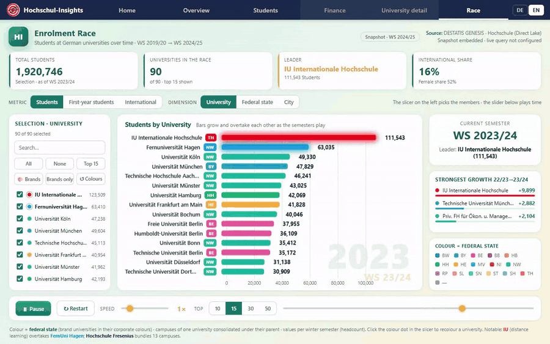

# Hochschul-Insights · Studierende-Race

Self-contained, animated **bar-chart race** of enrolment at German universities,
built as a Microsoft Fabric static-hosting **Rayfin** app. Data comes from the
**Hochschul-Insights** Direct Lake semantic model (DESTATIS GENESIS,



Datenlizenz Deutschland 2.0). A build-time snapshot is inlined into `index.html`
so the app renders instantly and offline; an optional **⚡ Live-Daten** button
re-queries the semantic model at runtime (see *Live data* below).

> **No deployment identifiers live in this repository.** Workspace, semantic
> model, tenant, app-registration and User Data Function ids are read at runtime
> from `config/live.json`, which is git-ignored. Copy `config/live.example.json`
> and fill it in locally. Without it the app runs snapshot-only and hides the
> live button.

## What it does
- **Race chart** of members over the Wintersemester axis (WS 2019/20 → WS 2024/25),
  bars grow / shrink / overtake as the semesters play. Colour = Bundesland,
  with a colour key in the right rail.
- **Metric switch:** students · first-year students · international students.
- **Dimensions-Umschalter (dimension):** Hochschule · Bundesland · Stadt
  (aggregated live from the university-level data).
- **DE/EN switch** in the top navigation. Only the chrome is translated —
  Hochschule, Stadt and Bundesland names stay German, because they are proper
  nouns that have to match the semantic model.
- **Report pages** (Home · Übersicht · Studenten) rebuild the Power BI report's
  IBCS layout in HTML; Finanzen and Hochschul-Detail are explicit placeholders.
- **Parent-university consolidation:** multi-campus brands are grouped under their
  Trägerhochschule in the Hochschule dimension — **IU Internationale Hochschule**
  (22 codes → ~123k) and **Hochschule Fresenius** (13 codes → ~17.6k). Bundesland /
  Stadt stay per-campus for accurate geography.
- **Custom colours:** click the colour dot next to any member in the slicer to pick a
  colour (persisted in localStorage). Quick actions: **🎨 Marken** applies corporate
  colours to IU (red `#E2001A`), Fresenius (deep blue `#0A2A5E`) and FernUni Hagen
  (cyan `#00A0E1`); **Nur Marken** isolates those three; **↺ Farben** resets. The three
  brand colours are applied by default on first visit and the members glow wherever shown.
- **Slicer** (left): searchable member multi-select with Alle / Keine / Top 15 — adapts
  to the selected dimension.
- **KPI tiles** react to metric/dimension/scope/time: current-metric total, members in
  the race, current leader, internationaler Anteil + Frauenanteil.
- Playback controls: Abspielen/Pause, Neu, Tempo, Top-N (10/15/30/50), Zeit-Regler.

## Live data
The **⚡ Live-Daten** button loads current numbers straight from the Direct Lake
semantic model. It only appears once `config/live.json` exists and is complete:

1. The user signs in with MSAL (`@azure/msal-browser` via esm.sh) using the SPA app
   registration named in the config (scope `…/powerbi/api/.default`).
2. That Power BI token is passed to a **`fabric_proxy` User Data Function**, which
   runs `executeQueries` server-side (browsers cannot call `api.powerbi.com`
   directly — CORS). Queries are **pivoted** (6 semesters as columns) and limited to
   the top ~260 universities so the proxy response stays small; a third query pulls
   all IU + Fresenius campuses so parent-consolidation still holds.
3. The rows are shaped in the browser (same name-cleaning + parent grouping as the
   build pipeline) and swapped into the race.

Requirements / notes:
- The Fabric **capacity backing the workspace must be Active**; if it is paused or
  anything fails, the app silently keeps the snapshot.
- The webapp origin must be in the SPA app's **redirect URIs** (add via Graph when
  the hosting URL changes). Silent SSO only works after one interactive sign-in.
- A placeholder or missing config is rejected rather than used, so a fresh clone is
  snapshot-only by default.
- Data updates roughly annually (one new Wintersemester), so the snapshot is usually
  identical to live; rebuild the snapshot via the pipeline below to refresh the default.

## Build & deploy
```powershell
npm install
npm run build:fabric   # assembles dist/ (index.html + config/live.json)
npx rayfin up --workspace-id <rayfin-workspace-id> --tenant <tenant-id> -y
```

Deployment state lives in `rayfin/.deployments.json` and `rayfin/.env`, both
git-ignored, so a later `npx rayfin up` reuses the existing target.

## Checks
```powershell
npm run lint   # ids agree across package/manifest/rayfin.yml, inline scripts parse,
               # and no tenant identifier has crept back into the source
npm test       # snapshot shape + DE/EN catalogue contract (node --test)
```

## Refreshing the data (new semesters)
The dataset is generated from the semantic model and inlined into `index.html`.
Scripts live in `tools/data/`:
1. `hi_dax.ps1 -DaxFile <query.dax> -Out <out.json>` runs an executeQueries DAX
   query against the model. It resolves the workspace and semantic model from
   `-WorkspaceId`/`-DatasetId`, then `HI_WORKSPACE_ID`/`HI_DATASET_ID`, then
   `config/live.json` — so with that file in place it needs no arguments beyond
   the query. Requires `az login` and an Active capacity.
   - `extract_studierende.dax` → `hi_stud.json` (university × semester: total / international / weiblich, plus Parent_University for consolidation)
   - `extract_studienanfaenger.dax` → `hi_anf.json` (university × semester: Studienanfänger)
   - `extract_coords.dax` / `extract_finanzen.dax` → `hi_coords.json` / `hi_finanzen.json`
     (slow-changing, committed — they rarely need regenerating)
2. `build_app.py` cleans names, tags multi-campus brands with a consolidation key
   (`g`), and builds the compact dataset → `hi_appdata.json`.
3. `inject.py` injects `hi_appdata.json` into the `/*__HI_DATA__*/` marker in `index.html`.
Then `npm run build:fabric` + `rayfin up` to redeploy.

## Gallery template
A packaged version of this app is prepared for the
[awesome-rayfin](https://github.com/microsoft/awesome-rayfin) gallery as
`higher-education-insights`, together with a written comparison against the
Power BI report shipped by the `hochschul-insights` Fabric Jumpstart.

## Fabric architecture

`npx rayfin up` provisions:

- Entra sign-in (Fabric identity)
- Static web app

## Getting started

```bash
npm install
npm run serve
npx rayfin up --workspace-id <your-workspace-guid> --tenant <your-tenant-guid>
```

Any workspace or item id this app needs is read from the environment, with no default.

## Project structure

```
config/         configuration
rayfin/         deployment config - redirect URIs are loopback only
test/           tests
tools/          data pipeline and build helpers
```

## Scripts

| Script | What it does |
|---|---|
| `npm run build:fabric` | build the bundle Fabric static hosting serves |
| `npm run rayfin:up` | deploy to your Fabric workspace |
| `npm run serve` | serve locally |

## Credits

Part of [Fabric-Apps](../../README.md), MIT licensed.

## Data

DESTATIS GENESIS via the Hochschul-Insights Direct Lake semantic model, Datenlizenz Deutschland 2.0.
