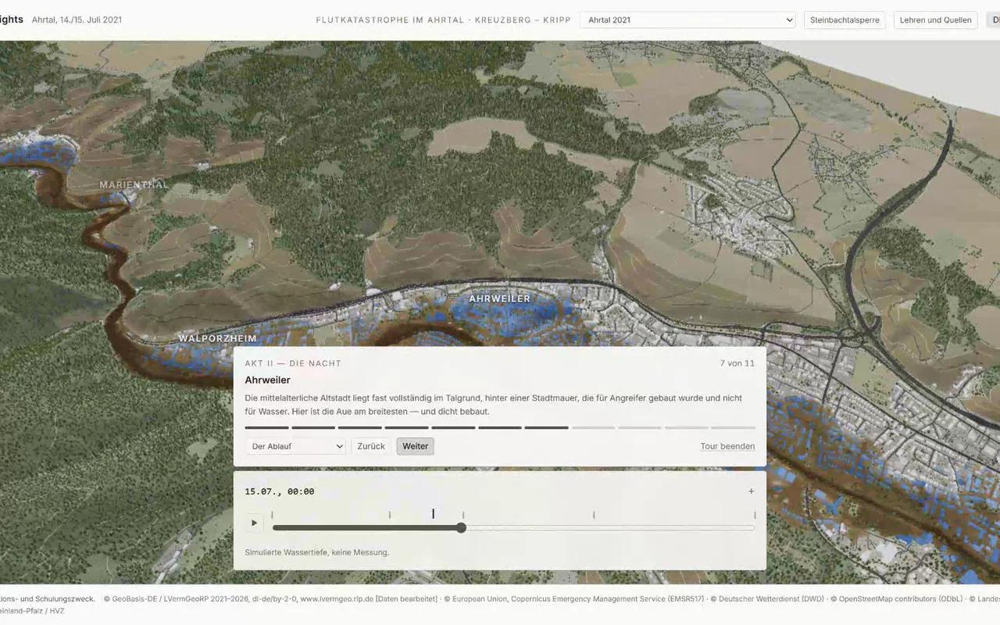

# Flood Insights

**A reconstruction of the Ahr valley flood of 14–15 July 2021, as an interactive 3D data twin.**

> ⚠️ **Demonstration and training purposes only. Not a real risk assessment and not a basis for
> insurance or financing decisions.**

<!-- TODO(phase-1e): no preview yet. Once `docs/previews/flood-insights.webp` exists, replace this comment with:
      -->

---

## What it does
On the night of 14 to 15 July 2021, 136 people died in Rhineland-Palatinate, most of them along the
Ahr. This application reconstructs what happened **entirely from publicly available data**, to
answer three questions: **what was known, what was missing, and what would be possible today?**

Flood Insights is a Microsoft Fabric App. It renders 24.6 km of the Ahr valley in 3D from official
1 m terrain and LoD2 building data, replays the flood along a scrubbable timeline driven by a
stage-discharge rating built from real cross-sections, and closes by letting the user ask *what
would have helped?* — more warning time, wider natural-hazard insurance cover, flood-adapted
rebuilding — and watch the numbers move.

The reconstruction is checked, not asserted. The simulated extent is scored against the Copernicus EMSR517
flood trace at 4 m resolution and reports **IoU 0.508** — good enough to reason about, not good enough to
pretend it is truth. That number is shown inside the app, next to the map, including when it is unflattering.

It is **not** a disaster experience and **not** a sales prop. The framing, content and tone rules
are binding and are written down alongside the project plan. They outrank every other part of this
repository.

## Getting started

You need Node 20+, Python 3.11+ and about 250 MB of download budget for the geodata.

```bash
npm install
pip install -r tools/requirements.txt

npm run data:build     # downloads and derives terrain, buildings and flood extent
npm run dev            # http://localhost:5173
```

`data:build` is the step people skip. Without it the app still starts, shows the remembrance screen, and then
tells you exactly which command you are missing instead of failing with a blank canvas — but there is no twin
to look at until it has run. It is safe to re-run and skips anything already downloaded.

Deploy to Fabric with Rayfin:

```bash
npx rayfin up --tenant <tenant-guid> --workspace "Rayfin Apps" --dry-run   # preview first
npx rayfin up --tenant <tenant-guid> --workspace "Rayfin Apps"
```

Then smoke-test the deployment itself:

```bash
FLUT_DEPLOYED_URL=https://<host>.webapp.fabricapps.net npx playwright test deployed
```

## Project structure

```
config/aoi/     area-of-interest definitions — the app is parameterised, not hard-coded
docs/           research notes, source documents, licence evidence
tools/geodata/  ingestion and preprocessing (DGM1, LoD2, EMSR517, OSM, gauges) + pipeline.py
tools/fabric/   lakehouse, semantic model and Real-Time Intelligence setup
src/            React + Three.js front end
  data/         the fact register — every figure with its source
  twin3d/       terrain, water, buildings, hydrograph, what-if engine
  components/   remembrance screen, shell, validation and Act IV panels
  i18n/         de.json / en.json — all user-facing strings
public/terrain/ generated heightmap, flow field and building mesh (built, not committed)
rayfin/         Fabric App deployment config (.env and .deployments.json are gitignored)
e2e/            Playwright specs, including the guardrail tests
```

## Scripts

| Script | What it does |
| --- | --- |
| `npm run dev` | Vite dev server on port 5173 |
| `npm run build` | Type-check and build to `dist/` |
| `npm run lint` | ESLint across the project |
| `npm test` | Vitest unit tests — the what-if engine and the fact register |
| `npm run test:e2e` | Playwright, 27 specs including the §2 guardrail rules |
| `npm run data:build` | The full geodata pipeline; `--list`, `--only` and `--skip` are supported |
| `npm run gauges:fetch` | Live Ahr gauge readings from the LfU Rheinland-Pfalz open API |
| `npm run fabric:setup` | Create the lakehouse, load the tables, build the semantic model |

## Three conventions worth knowing before you change anything

**The area of interest is configuration, not code.** No coordinate, village name or gauge id belongs in a
source file. It all lives in [config/aoi/ahrtal-2021.json](config/aoi/ahrtal-2021.json). Ahrtal 2021 is the
first *instance* of this app, not the app itself.

**An unsourced figure must look broken.** Every number shown to a user is declared in
[src/data/facts.ts](src/data/facts.ts) with its source. A fact with `source: null` renders through
`SourcedFigure` as a loud defect marker, not as a clean number. That is deliberate: PLAN §4.8 says an
unsourced claim does not ship, and a visible defect enforces that far better than a comment does. The death
toll was such a fact until the final report of the Landtag's committee of inquiry was cited, and correcting it
changed the number *and* the area it describes: the app claimed 134 deaths in the Landkreis Ahrweiler, while
the inquiry states 136 for Rheinland-Pfalz and gives no district figure at all. `isReleaseReady()` now returns
`true`, and a unit test pins both the value and its issuer so the scope cannot drift back.

**Observed damage is quoted, never inferred.** Real buildings carry damage grades only where Copernicus
EMSR517 graded them — attributed to Copernicus, matched by point-in-footprint containment rather than
proximity, never merged with modelled output, and never shown next to a monetary figure. The rules and the
reasoning are in PLAN §2.2. An earlier nearest-neighbour join was thrown away when it turned out the median
distance to a graded point was 255 m: close enough to label the wrong house.

## Data

Every layer in this app is public data under an open licence. That is not a convenience — it is the point:
*the data existed in 2021, it just was not connected.*

Full source list, licences and the mandatory attribution strings are in **[NOTICE.md](NOTICE.md)**. The
attribution is not decorative; it must travel with any redistribution or public deployment.

## Related

- Base app: `digital-twin-fabric-app` (wind-farm 3D twin — SceneEngine, Foundry voice/chat, tour, Rayfin deploy)
- Data pipeline patterns: `DWD-Wetter-Insights`

## Fabric architecture

`npx rayfin up` provisions:

- Entra sign-in (Fabric identity)
- Static web app

## Credits

Third-party data and licences: [NOTICE.md](NOTICE.md).
Licence: [LICENSE](LICENSE). Copyright (c) Microsoft Corporation..
