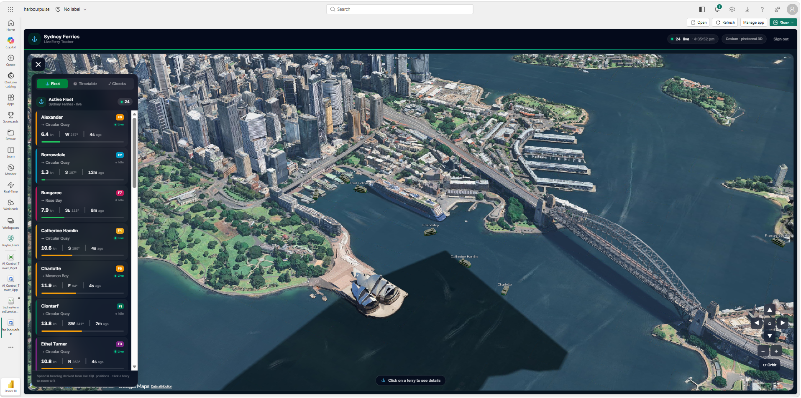
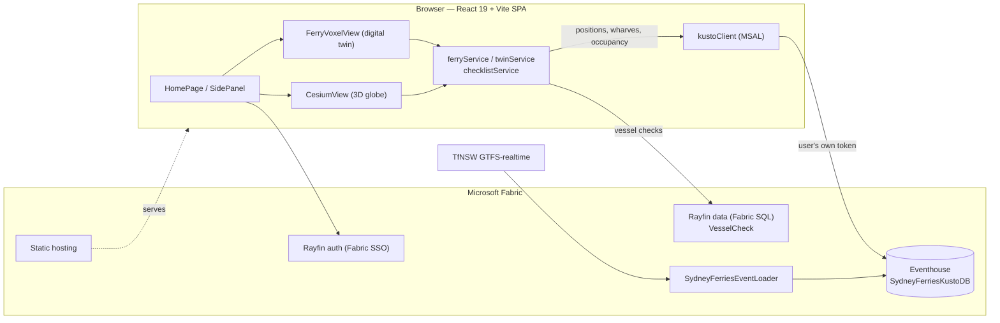
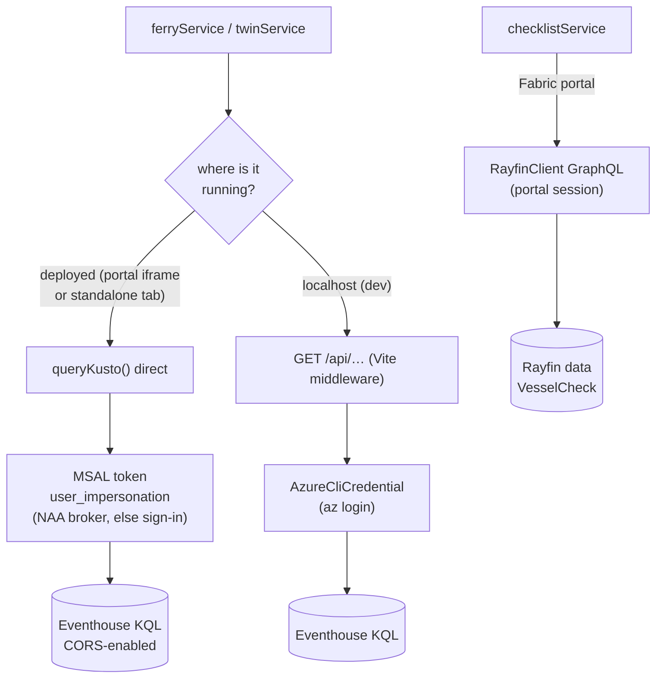
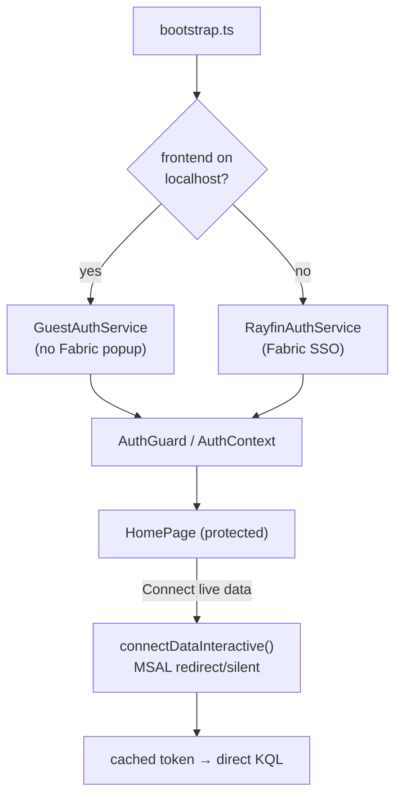
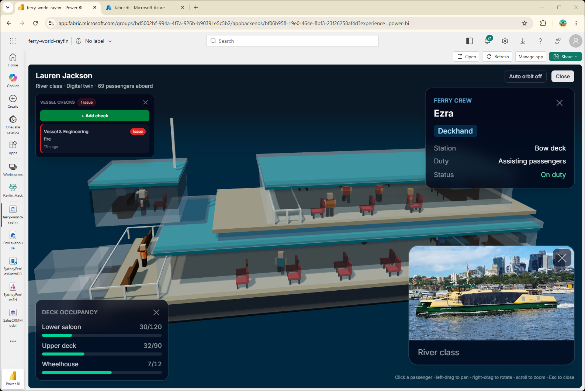
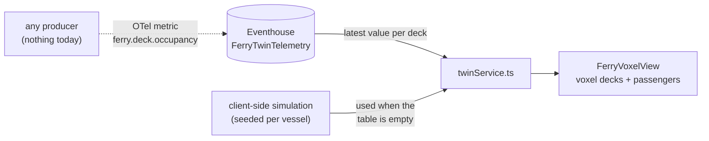
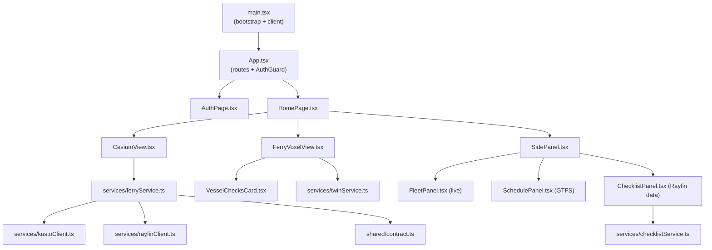

# Harbour Pulse — live Sydney Ferries on Microsoft Fabric

> **This is [Fran Genoa](https://github.com/FranGenoa)'s project.** The original work, the
> design, the voxel vessel twins and the Real-Time Intelligence architecture are his:
> **[FranGenoa/fabric-harbour-pulse](https://github.com/FranGenoa/fabric-harbour-pulse)**.
> It sits in this gallery with his name on it, not instead of it.
>
> The ferry photographs are Wikimedia Commons contributors' work, several under CC BY-SA —
> each credited individually in [ATTRIBUTION.md](ATTRIBUTION.md), as those licences require.



A photorealistic 3D map of Sydney Harbour that renders **live ferry positions**
from a Fabric Real-Time Intelligence **Eventhouse**, plus a **voxel digital
twin** of any vessel you click. Built as a **Rayfin Fabric App**: React 19 +
Vite + Cesium in the browser, Fabric SSO for identity, Fabric SQL for operator
checklists, and Fabric static hosting to serve it.

It runs inside the Fabric portal on the user's existing Fabric identity — no
separate hosting, no separate login, no separate access review. One
provisioning script stands the whole thing up in a tenant you own.

## What it does

- **Live tracking** — polls the latest position per ferry every few seconds and
  animates each vessel across the harbour. Heading is derived from movement;
  the TfNSW feed has no bearing field.
- **Photoreal 3D globe** — Google Photorealistic 3D Tiles and Cesium OSM
  Buildings when a Cesium Ion token is present, falling back to keyless
  OpenStreetMap imagery and extruded building footprints otherwise.
- **Digital twin** — click a ferry for a full-screen voxel vessel with decks,
  wheelhouse and passengers, sized by per-deck occupancy.
- **Vessel checks** — a pre-departure / in-service operator checklist written
  to Fabric SQL, immediately reportable and joinable to the telemetry.
- **Fleet and timetable** — a live fleet list you can fly the camera to, and
  today's TfNSW scheduled departures.

> **Positions are real. Occupancy is simulated.** TfNSW publishes vessel
> position, bearing, speed and stop, but no passenger counts — the
> `occupancy_status` field in its GTFS-realtime feed is empty for every ferry.
> The twin renders whatever is in `FerryTwinTelemetry` and falls back to a
> client-side simulation when that table is empty, so swapping in a real
> people-counting feed needs no front-end change.

### Why it matters in a business

An operator usually already has this data. What it tends to lack is one place
to see it and a way to ask questions across it.

- **One live picture instead of three systems.** Position, timetable and vessel
  condition sit in the same store, so "which vessels are running late and have
  an open defect" is a query rather than a morning spent reconciling exports.
- **On-time running becomes measurable.** Every position is retained beside the
  scheduled departures, so adherence can be trended by route, vessel or time of
  day instead of inferred from complaints.
- **Checks become evidence.** Pre-departure inspections are written as
  structured rows rather than paper or a shared spreadsheet — attributable,
  auditable, and joinable to the telemetry, so you can see whether a recurring
  defect tracks with usage.
- **Crowding can drive decisions.** The twin already renders per-deck occupancy;
  point it at a real people-counting feed and vessel allocation, crowding alerts
  and demand reporting follow with no front-end change.
- **Incidents can be replayed.** History is kept, so reconstructing where a
  vessel was, and when, does not depend on someone's recollection.
- **No new platform to govern.** It runs inside Fabric on the user's existing
  identity: no separate hosting bill, no second login, no extra access review.
  The tenant controls that already cover the data cover the app — which is
  usually what decides whether something like this ships at all.

The shape is not ferry-specific. Anything emitting position or condition
telemetry — buses, trucks, plant, field crews — fits the same pattern: a
real-time store, a live operational view, a digital twin, and operator
write-back that lands next to the telemetry it describes.

---

## Deploy it to your own Fabric tenant

This is the main path. One script does almost everything; the manual parts are
two permission grants and starting the data flowing. Budget about 30 minutes
the first time, most of it waiting.

### Before you start

**Accounts and roles.** You need a Fabric tenant and someone with the roles
below. It does not have to be the same person for all of them — steps 1–4 and
6 need the first and last, step 5 needs an administrator.

| To do this | You need |
|---|---|
| Create the Fabric workspace | **Contributor** on a Fabric capacity (F-SKU or trial), and a tenant that allows workspace creation |
| Register the sign-in app | **Application Developer** in Microsoft Entra — or the tenant setting *Users can register applications* set to **Yes** |
| Approve that app for everyone | **Cloud Application Administrator** or higher |
| Give people access to the data | **Admin** or **Member** on the new workspace |

**Tools on your machine.** Install these first:

| Tool | Version | Check with |
|---|---|---|
| [Node.js](https://nodejs.org) | 20 or newer | `node --version` |
| [Python](https://www.python.org/downloads/) | 3.11 or newer | `python --version` |
| [Azure CLI](https://learn.microsoft.com/cli/azure/install-azure-cli) | any current | `az --version` |
| PowerShell | 7 or newer | `pwsh --version` |

**Three values to collect.** Have these to hand before you start:

| Value | Where to find it |
|---|---|
| **Tenant id** | Run `az account show --query tenantId -o tsv` |
| **Capacity id** | Fabric portal → **Settings → Admin portal → Capacity settings** → click your capacity → the GUID is in the browser address bar |
| **Workspace name** | Whatever you want to call it, e.g. `Harbour Pulse`. It is created if it does not exist. |

### Step 1 — get the repo and its dependencies

```powershell
git clone <this repo>
cd fabric-harbour-pulse
npm ci
pip install -r fabric/requirements.txt
```

### Step 2 — get two free API keys

Both are free and take a couple of minutes each.

| Key | How to get it |
|---|---|
| **TfNSW API key** | Sign up at [opendata.transport.nsw.gov.au](https://opendata.transport.nsw.gov.au) → **My Account → Applications → Create Application** → tick the *Public Transport – Realtime* and *Timetables* APIs → copy the key. |
| **Cesium Ion token** | Sign up at [ion.cesium.com](https://ion.cesium.com) → **Access Tokens** → copy the default token. Optional — without it the globe still works with plain OpenStreetMap imagery. |

Copy `.env.example` to `.env` and paste them in:

```ini
VITE_CESIUM_ION_TOKEN=<your Cesium token>
TFNSW_API_KEY=<your TfNSW key>
```

Leave everything else blank — step 4 fills it in. `.env` is git-ignored; keep
it that way.

> **Do this before step 4, not after.** The deployed timetable is baked into
> the JavaScript bundle at build time, because static hosting has no server to
> hold an API key at runtime. If the key is missing when the build runs, the
> Timetable panel deploys empty.

---

**You now have everything you need. Pick how you want to finish:**

|  | |
|---|---|
| **[Deploy it yourself](#step-3--sign-in)** | Carry on with steps 3–7 below. Around twenty minutes, most of it waiting on Fabric. You will run four commands and click through two permission grants. |
| **[Ask an AI agent to deploy it](#deploying-with-an-ai-coding-agent)** | Hand the whole thing to Copilot or Claude Code. The repo ships a skill that walks the agent through it, so you only answer questions and do the two clicks an agent cannot do for you. |

Both routes end at the same place, and the agent route still needs you present
for the permission grants in [step 5](#step-5--grant-the-two-permissions) — a
consent prompt is deliberately a human decision.

---

### Step 3 — sign in

```powershell
az login --tenant <your tenant id>
```

Then confirm it actually worked:

```powershell
az ad signed-in-user show --query userPrincipalName -o tsv
```

If that errors — especially with `TokenCreatedWithOutdatedPolicies` — sign in
again with an explicit scope:

```powershell
az login --tenant <your tenant id> --scope 'https://graph.microsoft.com//.default'
```

The doubled slash in `//.default` is not a typo. With a single slash the Azure
CLI recognises the scope, finds the cached token and returns without prompting
you — which is useless when the cached token is precisely the problem.

### Step 4 — run the provisioning script

```powershell
./scripts/provision-environment.ps1 `
    -TenantId      <your tenant id> `
    -WorkspaceName 'Harbour Pulse' `
    -CapacityId    <your capacity id>
```

This takes 10–20 minutes. It:

1. Creates the workspace, or reuses it if the name already exists.
2. Registers a Microsoft Entra app so the browser can fetch data — see
   [the sign-in app](#the-sign-in-app) for what it is and why.
3. Publishes every Fabric item: Eventhouse, KQL database, Eventstream, loader
   notebook, dashboard and lakehouse.
4. Writes the generated cluster URI and app ids back into your `.env`.
5. Seeds `Files/.env` in the lakehouse so the loader notebook can authenticate.
6. Builds and deploys the app, then registers its new URL as a valid sign-in
   redirect.

**It is safe to re-run.** If it fails partway, run it again rather than
patching by hand. It deletes nothing unless you explicitly pass
`-PruneOrphans`.

When it finishes it prints your **hosting URL**. Keep it.

### Step 5 — grant the two permissions

The app has no server of its own: each user's browser queries the Eventhouse
directly using that user's own identity. That is what keeps Fabric's
permissions in charge, and it is why two grants are needed once per tenant.

**a) Approve the sign-in app for your organisation.**

> Entra admin center → **Entra ID → App registrations** → `HarbourPulse Kusto
> Client` → **API permissions** → **Grant admin consent for \<tenant\>**

Needs **Cloud Application Administrator** or higher. Without it, every
first-time user hits an "approval required" screen and stops.

The app asks for nothing up front and requests its data permission on demand,
so the permission may only appear in that list after someone has signed in
once. If the list is empty, open the app, sign in, then come back.

**b) Give people read access to the data.**

> Fabric portal → your workspace → `SydneyFerriesKustoDB` → **Manage
> permissions** → add users as **Viewer**

Anyone with **Member** or **Admin** on the workspace already has this. Without
it, sign-in succeeds and every query silently returns **403**.

### Step 6 — start the data flowing

The Eventhouse is created empty. Open your workspace and run the
**`SydneyFerriesEventLoader`** notebook.

It polls TfNSW every 15 seconds and pushes into the Eventstream, then **stops
itself after 10 minutes** so a forgotten notebook cannot hold a Spark session
open. While it runs its status stays "not started" even though it is working —
judge it by rows, not status. Give it a couple of minutes (a cold Spark session
is slow to start), then check in the KQL database:

```kusto
SydneyFerries
| summarize rows = count(), vessels = dcount(ferry_name), latest = max(timestamp)
```

Re-run the cell whenever you want more data. To change the limit, edit
`RUN_MINUTES` in the last cell — `0` means run until stopped.

**Stopping it early.** The notebook holds a Spark session, which consumes
capacity until it is released, so stop it when you are done:

- **In the notebook** — press the stop button beside the running cell, then
  **Session ready** in the bottom-left corner → **Stop session**. Stopping the
  cell alone leaves the session alive and still billing.
- **From the workspace** — Fabric portal → **Monitor** hub → filter **Item
  type = Notebook** → find the run with status **Running** → **Cancel**.

An idle session also expires on its own after 20 minutes, but that timer only
starts once nothing is executing — a running loop keeps it alive indefinitely,
which is why the 10-minute limit exists.

For unattended running, put the notebook on a Fabric schedule instead of
leaving a session open.

### Step 7 — check it works

Open the hosting URL.

**Expect the first connection to be blocked.** Inside the Fabric portal the app
cannot always get an Eventhouse token silently, so the header offers **Connect
live data**, which opens a second sign-in window. On a first visit there is no
cached account to sign in with, so that window is a fresh pop-up — and the
browser blocks it. It looks as though the button did nothing.

When that happens:

1. Allow pop-ups for the site — the blocked-pop-up icon sits at the right-hand
   end of the address bar.
2. Press **Connect live data** again.

The second attempt goes through. Later visits reuse the account and usually
connect without asking. Until it succeeds the globe still draws, but anything
fed by the Eventhouse stays empty — no ferries, and the vessel picker in
**Checks** shows a placeholder instead of the fleet.

Then confirm:

- ferries are moving on the globe,
- the **Timetable** panel lists departures,
- clicking a ferry opens the voxel twin with passengers on the decks,
- a vessel check can be saved and deleted.

**No wharf markers is expected.** The `ReferenceLocation` table is created
empty and this repo ships no wharf rows for it.

### If something goes wrong

| What you see | What it means |
|---|---|
| **Connect live data** seems to do nothing | The sign-in pop-up was blocked. Allow pop-ups for the site and press it again — step 7. |
| `TokenCreatedWithOutdatedPolicies`, or a Graph error right after a successful login | Stale cached token. Redo step 3 with the doubled-slash scope. |
| The script fails near the end with a bare `500` uploading static content | Known transient in the upload service. The script retries once; if it still fails run `npx rayfin up staticapp deploy`. Nothing else needs redoing. |
| Everything loads but there is no data, and the browser console shows 403 | Missing Viewer on the KQL database — step 5b. |
| "Approval required" on first sign-in | Missing admin consent — step 5a. |
| Globe fine, no ferries | The loader notebook is not running — step 6. |
| Vessel picker in **Checks** stays empty | Not connected yet (step 7), or `SydneyFerries` has no rows yet (step 6). The placeholder text says which. |
| Timetable panel empty | `TFNSW_API_KEY` was unset when the bundle was built. Set it in `.env` and re-run step 4. |
| Globe looks flat and grey | No Cesium Ion token. Harmless — it fell back to OpenStreetMap. |

### The sign-in app

The Entra app registration the script creates (`HarbourPulse Kusto Client`) is
a **public SPA client**. It holds no secret and grants nothing on its own — it
is only the thing that lets a browser ask for a token on the signed-in user's
behalf. Every query still runs as that user, against their own Fabric
permissions.

| Setting | Value | Why |
|---|---|---|
| Platform | Single-page application | Browser-based, so tokens use PKCE and no client secret exists |
| Sign-in audience | Single tenant | Only your organisation's accounts |
| Redirect URIs | Your hosting URL, plus `http://localhost:5173` | Patched automatically after each deploy |
| API permission | Kusto `user_impersonation`, delegated | Query the Eventhouse *as the signed-in user* |
| Client secret | none | It is a public client — a secret in a browser is not a secret |

Two independent redirect-URI lists exist and both must contain the hosting URL:
`services.auth.allowedRedirectUris` in [rayfin/rayfin.yml](rayfin/rayfin.yml)
for Fabric SSO, and the SPA redirect URIs on the app registration for the
Eventhouse token. The script maintains both. Deploying a *brand new* app mints
a new random hostname, so both need refreshing — which re-running the script
does.

### Deploying changes later

Once the environment exists you rarely need the full script.

```powershell
npm run rayfin:up                      # app only (frontend + auth + data)

$env:FABRIC_WORKSPACE_ID = '<workspace guid>'
python fabric/deploy.py                # Fabric artefacts only
```

`fabric/parameter.yml` is what makes the Fabric side portable: workspace id,
Eventhouse and KQL database ids, lakehouse id and cluster URI are all resolved
against the **target** workspace at publish time, so no item definition ever
needs hand-editing.

> **Rebuild at least fortnightly.** The timetable is a 14-day snapshot baked in
> at build time, so it ages out and the Timetable panel eventually empties. See
> [Roadmap](#roadmap) for the fix.

### Deploying with an AI coding agent

The repo ships a skill at
[.agents/skills/deploy-harbourpulse/](.agents/skills/deploy-harbourpulse/SKILL.md)
covering this whole procedure, including the failure modes worth knowing about.
Agents that read `.agents/skills` — GitHub Copilot in VS Code, Claude Code and
similar — pick it up automatically from a clone. Say *"deploy this repo to my
Fabric tenant"* and supply the three values from
[Before you start](#before-you-start).

---

## How it works

### System overview



**Live positions and wharves always come from the Eventhouse.** Fabric SQL is
used only for the vessel-check capture feature.

### Data path — three modes

The service layer picks its transport at runtime, so only the plumbing changes
between environments:



- **Fabric portal (embedded)** — positions and wharves are read straight from
  the Eventhouse ([kustoClient.ts](src/services/kustoClient.ts)). Nested App
  Auth lets the portal broker the Kusto token silently where it can; otherwise
  the header shows a one-time **Connect live data** button, which is a second
  sign-in on top of the Fabric session. Vessel checks go through the Rayfin
  **data** service ([rayfinClient.ts](src/services/rayfinClient.ts)) on the
  portal session.
- **Deployed standalone** — a plain browser tab queries the Eventhouse directly
  with an MSAL access token for the signed-in user. The Eventhouse allows CORS
  from the app origin.
- **Local dev** — a dev-only Vite middleware ([vite/ferryApi.ts](vite/ferryApi.ts))
  queries the Eventhouse with your `az login` identity and exposes a
  same-origin JSON API. No CORS, no browser tokens.

### Authentication

App identity and live-data access are two separate things, which is the part
that usually surprises people:



Signing in gets you into the *app*. Reading the Eventhouse needs a *second*
token, scoped to Kusto and carrying your own identity — the app never holds a
service credential on your behalf. That is why **Connect live data** exists in
a standalone tab and never appears inside the Fabric portal, where the portal
session can be brokered silently.

### Data in the Eventhouse

Eventhouse `SydneyFerriesEventhouse` → KQL database `SydneyFerriesKustoDB`.

| Table | Columns |
|---|---|
| `SydneyFerries` | `ferry_name`, `ferry_lat`, `ferry_long`, `ferry_destination`, `timestamp` |
| `ReferenceLocation` | `LocationId`, `LocationName`, `Latitude`, `Longitude`, `ProximityThreshold` |
| `FerryTwinTelemetry` | OpenTelemetry metrics — `MetricName`, `MetricValue`, `VesselId`, `DeckId`, `Attributes`, `Timestamp` |

Latest position per active ferry, anchored to the newest sample so the map
stays populated if the feed pauses:

```kusto
SydneyFerries
| summarize arg_max(timestamp, *) by ferry_name
| where timestamp > todatetime('<latest>') - 15m
| project ferry_name, ferry_lat, ferry_long, ferry_destination, timestamp
```

### Digital twin



Clicking a ferry opens [FerryVoxelView.tsx](src/components/FerryVoxelView.tsx):
a Three.js voxel vessel whose decks are populated from occupancy telemetry,
with crew and passenger cards and the vessel checklist inline.

[twinService.ts](src/services/twinService.ts) reads the latest value per deck
from `FerryTwinTelemetry` and falls back to a client-side simulation when the
table is absent or empty — which today is always, because nothing writes to it.
Occupancy is therefore invented in the browser and consistent per vessel, not
real. Anything that ingests the OpenTelemetry metrics shape into that table
(`MetricName` = `ferry.deck.occupancy`, capacity in the attributes) makes the
decks real with no front-end change. See [Roadmap](#roadmap).



### Frontend module map



> **Renderers:** [CesiumView.tsx](src/components/CesiumView.tsx) is the harbour
> view and [FerryVoxelView.tsx](src/components/FerryVoxelView.tsx) the digital
> twin. The Three.js building blocks they share live in [src/three/](src/three/).

### Rayfin services

Configured in [rayfin/rayfin.yml](rayfin/rayfin.yml):

| Service | Enabled | Notes |
|---|---|---|
| `auth` | yes | Fabric SSO + password |
| `data` | yes | Data API Builder, `mssql` — the `VesselCheck` entity only |
| `staticHosting` | yes | Serves `dist/` via `npm run build:fabric` |
| `storage`, `functions` | no | Not used |

---

## Run locally

For development only. Everything above is how you *ship* it.

```powershell
az login          # as a user with read access to SydneyFerriesKustoDB
npm run dev
```

Open <http://localhost:5173>.

`npm run dev` regenerates env vars, deploys the backend services excluding
static hosting, then serves the frontend. Ferry data comes from the Vite dev
middleware ([vite/ferryApi.ts](vite/ferryApi.ts)), which exposes:

| Route | Returns |
|---|---|
| `GET /api/ferries/live` | Latest position per active ferry |
| `GET /api/ferries/fleet` | Full vessel roster — backs the vessel-checks picker |
| `GET /api/reference-locations` | Wharves |
| `GET /api/ferries/schedule` | Today's departures. Accepts `?scope=all` and `?limit=N` |

### Environment variables

`VITE_*` values are generated by `rayfin env --framework vite`; override them
in `.env`.

| Variable | Purpose |
|---|---|
| `VITE_KUSTO_CLUSTER`, `VITE_KUSTO_DATABASE` | Eventhouse target |
| `VITE_ENTRA_CLIENT_ID`, `VITE_ENTRA_TENANT_ID` | Sign-in app for the Eventhouse token |
| `VITE_KUSTO_SCOPE` | Token-scope override (default `<cluster>/user_impersonation`) |
| `VITE_CESIUM_ION_TOKEN` | Cesium Ion token — 3D Tiles, OSM Buildings, terrain |
| `VITE_FERRY_API`, `VITE_FERRY_MODEL_URL` | Data API base, ferry `.glb` override |
| `VITE_RAYFIN_PUBLISHABLE_KEY`, `VITE_FABRIC_WORKSPACE_ID` | Rayfin / Fabric SSO |
| `TFNSW_API_KEY` | TfNSW key. **Server-side only** — no `VITE_` prefix |
| `KUSTO_CLUSTER_URI`, `KUSTO_DATABASE`, `FERRY_ACTIVE_WINDOW` | Dev middleware overrides |

## Scripts

| Command | Description |
|---|---|
| `npm run dev` | Deploy backend services, start the dev server |
| `npm run build` | Production build (`tsc -b && vite build`) |
| `npm run build:fabric` | Build for Fabric static hosting |
| `npm run build:ferry` | Rebuild the bundled ferry `.glb` |
| `npm run lint` / `npm run test` | ESLint / Vitest |
| `npm run rayfin:up` | Deploy all Rayfin services to Fabric |

---

## Project structure

```text
├── scripts/                           # provision-environment.ps1, build-ferry-glb.mjs
├── .agents/skills/                    # Agent skills (deployment, Rayfin)
├── .github/workflows/                 # Rayfin and Fabric deploy pipelines
├── fabric/                            # Fabric artefacts + deploy.py + parameter.yml
├── rayfin/                            # Fabric service config + data entities
├── vite/                              # Dev KQL API, GTFS builder, timetable snapshot
├── public/                            # Ferry photos, bundled .glb models
├── docs/screenshots/                  # README images
└── src/
    ├── components/                    # CesiumView, FerryVoxelView, side panels
    ├── services/                      # Data layer, auth, Kusto and Rayfin clients
    ├── hooks/                         # Auth context
    ├── pages/                         # HomePage
    ├── shared/                        # Types, config, geo helpers
    ├── three/                         # Voxel ferry models and harbour backdrop
    └── __tests__/                     # Vitest specs
```

---

## Roadmap

**Self-refreshing timetable.** The deployed timetable is a build-time snapshot
of 14 service days, so it ages out. Cheapest first:

1. *Rebuild weekly.* A `schedule:` trigger on
   30_deploy_rayfin.yml keeps the
   snapshot under a week old against a 14-day horizon. Four lines of YAML.
2. *Ingest the timetable into the Eventhouse.* The preferred fix. A sibling of
   the loader notebook pointed at `/v1/gtfs/schedule/ferries/sydneyferries`
   would land `trips`, `stop_times`, `routes`, `stops` and `calendar` as KQL
   tables daily. The join in `departuresForDay`
   ([vite/gtfsSchedule.ts](vite/gtfsSchedule.ts)) ports almost line-for-line to
   a KQL function, and the browser then reads departures over the *existing*
   Kusto path — no new auth, no new CORS surface. It also removes
   `TFNSW_API_KEY` from the build entirely, cutting the secret locations from
   three to two. Land each service day as a replace, not an append.

**A data function to remove the Eventhouse grant.** Today every user needs
Viewer on `SydneyFerriesKustoDB` or the map returns 403, because the browser
queries Kusto with that user's own token. A **Fabric User Data Function**
holding the same queries would run under one identity and make step 5b
disappear. Note that `VITE_FERRY_API` alone is not enough to switch: in a
deployed build `useDirectKusto` in
[ferryService.ts](src/services/ferryService.ts) short-circuits to the direct
path whenever the Kusto vars are present, so this needs an explicit preference
flag too. Fabric User Data Functions are in preview, and browser CORS against
the function endpoint is the open question.

**Real occupancy data.** Per-deck counts are simulated because TfNSW publishes
none. The table schema is the contract — point a real people-counting feed at
`FerryTwinTelemetry` and the voxel twin renders it with no front-end change.

**One home for vessel checks.** Standalone builds write checks to
`localStorage`; inside the Fabric portal they go to Fabric SQL. The two never
reconcile. Reading through to the backend whenever an authenticated Rayfin
client exists would collapse them.

**Wharf markers.** `ReferenceLocation` ships empty. TfNSW `stops.txt` from the
GTFS schedule bundle is the obvious source.

---

## Licence and attribution

**Harbour Pulse is Fran Genoa's project.** The upstream repository is
[FranGenoa/fabric-harbour-pulse](https://github.com/FranGenoa/fabric-harbour-pulse), and the
design, the voxel vessel twins and the Real-Time Intelligence architecture are his work. This
folder exists in the gallery with his name on it, not instead of it.

Source code is MIT — see [LICENSE](LICENSE). It does **not** cover the ferry
photographs, map data or map tiles, which keep their own licences: see
[ATTRIBUTION.md](ATTRIBUTION.md) for per-image authors and terms, and note that
several photos are CC BY-SA (share-alike).

Security notes and reporting: [SECURITY.md](../../SECURITY.md).

> **About the identifiers in this repo.** The workspace, capacity, tenant, Entra client and
> Eventhouse cluster ids have been replaced with placeholders such as
> `<source-workspace-id>` and `<your-eventhouse>.kusto.fabric.microsoft.com` on the way into
> this gallery. `provision-environment.ps1` fills in your own when you deploy.

## Fabric architecture

`npx rayfin up` provisions:

- Entra sign-in (Fabric identity)
- Fabric SQL database
- Static web app

## Getting started

```bash
npm install
npm run dev
npx rayfin up --workspace-id <your-workspace-guid> --tenant <your-tenant-guid>
```

Any workspace or item id this app needs is read from the environment, with no default.


## Data

Live vessel positions come from the **Transport for NSW** open real-time feed, streamed into a
Fabric Eventhouse. The base map is Google Photorealistic 3D Tiles and Cesium OSM Buildings.
Ferry photographs are from Wikimedia Commons under their own licences — see
[ATTRIBUTION.md](ATTRIBUTION.md).

## Credits

- **Fran Genoa** — original project and upstream repository:
  [FranGenoa/fabric-harbour-pulse](https://github.com/FranGenoa/fabric-harbour-pulse)
- **Ferry photographs** — Wikimedia Commons contributors, credited individually with author,
  licence and source page in [ATTRIBUTION.md](ATTRIBUTION.md). Several are CC BY-SA, so the
  share-alike terms travel with them.
- **Transport for NSW** — open real-time vessel positions.
- Licence: [LICENSE](LICENSE). Copyright (c) 2026 HarbourPulse contributors.
