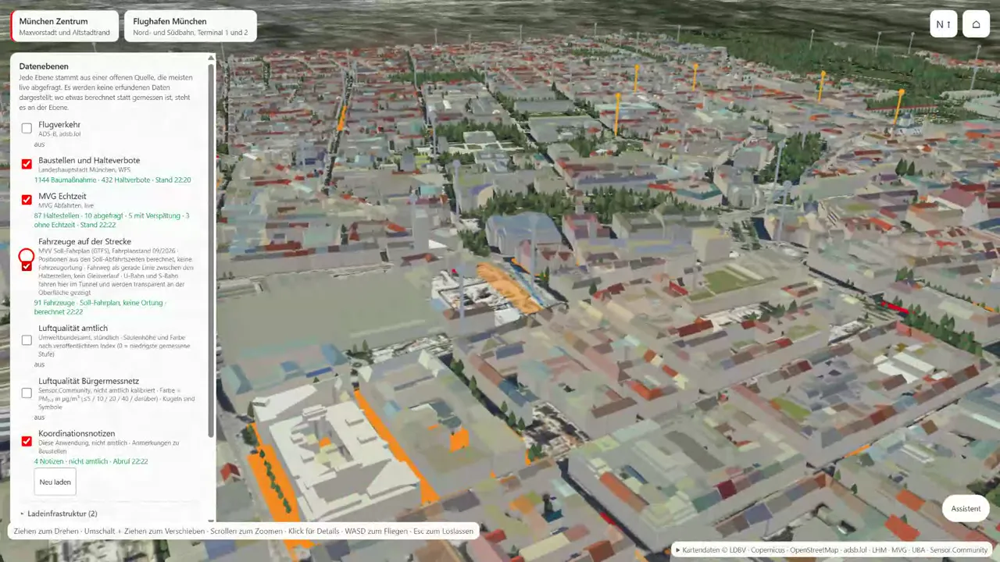

# Munich Twin (München Zwilling)



Munich city centre and Munich Airport as **one continuous 1:1 3D twin**, with switchable data
layers from live open sources, an assistant that answers questions about construction sites with
visible tool calls, and shared coordination notes. Built as a **Microsoft Fabric App** (preview).

The app UI is German. The step-by-step guide for running the twin in your own tenant is German
too: **[UMSETZUNG.md](UMSETZUNG.md)**.

## What it does

- **Two survey-grade cores in one scene.** Munich city centre (3.25 x 3.94 km) and Munich Airport
  (8.58 x 5.81 km), 28 km apart, joined by a coarse terrain shell. Switching between them is a
  camera flight, not a reload.
- **Live open-data layers.** Construction sites and temporary no-parking zones from the city's
  WFS, MVG stops with live departures, vehicles moving along the published timetable, ADS-B air
  traffic. Every layer is built only when switched on and shows its source and timestamp.
- **Assistant with tools.** A question such as "which construction sites on this street overlap
  in space and time?" runs a query for nearby construction sites (within a radius) with
  overlapping dates and shows the tool call.
  When the data does not contain an answer (for example who carries out the work), it says so.
- **Coordination notes.** A note drafted by the assistant is confirmed by a person and appears on
  the map for everyone who opens the app.
- **No synthetic fallback.** If a source is down, its measurements are not replaced with made-up
  data; the layer panel says what failed.
- **Strict 1:1 scale.** Terrain, buildings and objects are never exaggerated.

## Architecture

| Part | What | Runs on |
|---|---|---|
| `src/`, `index.html`, `public/` | three.js scene, data layers, assistant panel | Fabric App static hosting |
| `public/terrain/`, `public/data/` | prebuilt terrain, orthophoto, LoD2 buildings, trees, timetable | shipped with the app |
| `server/` | assistant (FastAPI, Azure OpenAI with tool calls) and notes store | Azure Container App |
| `server/sql/koordination.sql` | coordination notes schema | Fabric SQL database |
| `relay/` | small ADS-B relay, because the providers send no CORS headers | Azure Container App |

Fabric Apps are not available in every region yet (for example not in Germany West Central or
North Europe); see [Fabric region availability](https://learn.microsoft.com/fabric/admin/region-availability)
and [Multi-Geo](https://learn.microsoft.com/fabric/admin/service-admin-premium-multi-geo).

⚠️ The static app and everything under `public/` is anonymously downloadable once deployed, and the
coordination notes are not confidential in this version. Details in [UMSETZUNG.md](UMSETZUNG.md).

## Getting started

```powershell
npm ci
npm run dev          # http://127.0.0.1:5190
```

Map and data layers work immediately. The assistant, notes and air traffic need the services in
`server/` and `relay/`; deployment to your own tenant is described in [UMSETZUNG.md](UMSETZUNG.md).
All tenant-specific values come from environment variables, with no defaults.

## Project structure

```
config/aoi/        the two areas of interest with their measured bounds
public/terrain/    prebuilt cores and shell (open data, see NOTICE.md)
public/data/       timetable extract for the vehicle layer
relay/             ADS-B relay (zero-dependency Node)
server/            assistant, tools, notes store, Entra token check
src/               app: scene, live layers, assistant client
tests/             unit tests
tools/             asset gates, deployment scripts, geodata pipeline (tools/geodata/)
```

## Scripts

| Script | What |
|---|---|
| `npm run dev` | local dev server on port 5190 |
| `npm run build` | type check, asset gate, Vite build, bundle gate (no unapproved identifiers) |
| `npm test` | unit tests: map, geometry, relay, timetable |
| `npm run data:flughafen` | rebuild the airport core from open data (optional) |

## Data

| Layer | Source |
|---|---|
| Terrain, orthophoto, LoD2 buildings, trees | Bayerische Vermessungsverwaltung (CC BY 4.0) |
| Coarse shell | Copernicus DEM GLO-30 |
| Construction sites, no-parking zones, stops | City of Munich open data (`mor_wfs`) |
| Departures | Munich public transport operator MVG (public departures interface) |
| Vehicles | MVV timetable (GTFS), positions computed from the schedule, not tracked |
| Air traffic | adsb.lol (ODbL) |
| Land cover, airport geometry | OpenStreetMap contributors (ODbL) |

Aircraft are drawn as simple procedural silhouettes at the published length of their type; no
third-party model files are included.

## Credits

Map data notices, attribution strings and licences: [NOTICE.md](NOTICE.md) and
`public/THIRD-PARTY-NOTICES.txt`. Code: [LICENSE](LICENSE).
